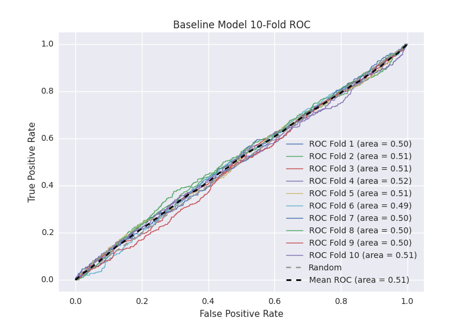

# Baseline Model
**Model Performance Score Report**

### K-Fold Classification Report
| K | Accuracy | Precision | Recall | F-Measure | AUC | Kappa |
|-|
| 1 | 0.720864127345 | 0.228187919463 | 0.0829268292683 | 0.121645796064 | 0.498839248585 | -0.00298222856552 |
| 2 | 0.722980659841 | 0.384615384615 | 0.0529661016949 | 0.0931098696462 | 0.510930951314 | 0.0300673172566 |
| 3 | 0.714448236633 | 0.292682926829 | 0.110599078341 | 0.160535117057 | 0.511492892645 | 0.0290626801565 |
| 4 | 0.708759954494 | 0.324840764331 | 0.111597374179 | 0.166123778502 | 0.515060793162 | 0.0382706103339 |
| 5 | 0.705915813424 | 0.290322580645 | 0.0995575221239 | 0.148270181219 | 0.507665437938 | 0.019525645479 |
| 6 | 0.711604095563 | 0.197604790419 | 0.0812807881773 | 0.115183246073 | 0.491084181071 | -0.0224564945568 |
| 7 | 0.70534698521 | 0.261437908497 | 0.0898876404494 | 0.133779264214 | 0.501912594025 | 0.00488463732387 |
| 8 | 0.695108077361 | 0.238095238095 | 0.0892857142857 | 0.12987012987 | 0.495787895311 | -0.0106048906049 |
| 9 | 0.722980659841 | 0.24358974359 | 0.0425055928412 | 0.072380952381 | 0.498750889479 | -0.00343171381757 |
| 10 | 0.720705346985 | 0.320987654321 | 0.0562770562771 | 0.0957642725599 | 0.506919392336 | 0.0188371696505 |

### Average Confusion Matrix
| | Pred POS | Pred NEG |
|-|
| **True POS** | 36.1 | 407.2 |
| **True NEG** | 97.6 | 1217.2 |

### Average Model Performance Metrics
| ACC | PRE | REC | F1 | AUC | KAPP |
|-|
| 0.71287139567 | 0.278236491081 | 0.0816883697638 | 0.123666260759 | 0.503844427587 | 0.0101172732656 |

### AUC/ROC Plot

