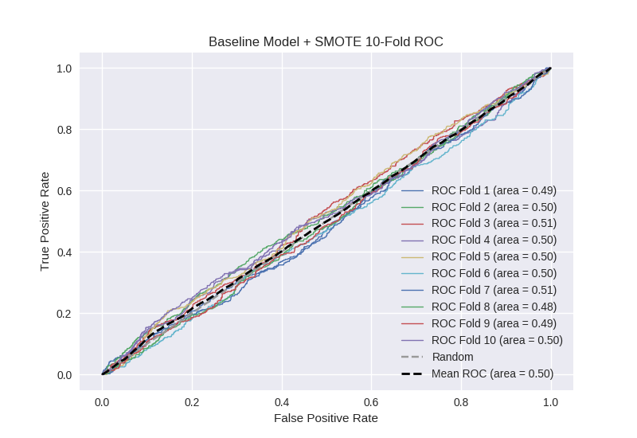

# Baseline Model + SMOTE
**Model Performance Score Report**

### K-Fold Classification Report
| K | Accuracy | Precision | Recall | F-Measure | AUC | Kappa |
| --- | --- | --- | --- | --- | --- | --- |
| 1 | 0.282546901649 | 0.230379746835 | 0.887804878049 | 0.365829145729 | 0.493198213672 | -0.00682507789787 |
| 2 | 0.442548350398 | 0.266544117647 | 0.614406779661 | 0.371794871795 | 0.496939004138 | -0.00433249699197 |
| 3 | 0.3401592719 | 0.25170998632 | 0.847926267281 | 0.388185654008 | 0.510821139683 | 0.0120495002306 |
| 4 | 0.328782707622 | 0.258839226151 | 0.849015317287 | 0.39672801636 | 0.49752841191 | -0.00284158753762 |
| 5 | 0.549488054608 | 0.257834757835 | 0.400442477876 | 0.313691507799 | 0.500757226687 | 0.00128252580115 |
| 6 | 0.626279863481 | 0.233545647558 | 0.270935960591 | 0.250855188141 | 0.501962063136 | 0.00371599066344 |
| 7 | 0.390216154721 | 0.256031128405 | 0.739325842697 | 0.380346820809 | 0.505611131554 | 0.00691050698481 |
| 8 | 0.319112627986 | 0.247471341875 | 0.819196428571 | 0.380113930606 | 0.483644015812 | -0.0185853344499 |
| 9 | 0.530716723549 | 0.243902439024 | 0.402684563758 | 0.303797468354 | 0.48852763657 | -0.0188920221039 |
| 10 | 0.342434584755 | 0.264266304348 | 0.841991341991 | 0.402275077559 | 0.503171596922 | 0.00372381417402 |

### Average Confusion Matrix
| | Pred POS | Pred NEG |
| --- | --- | --- |
| **True POS** | 296.6 | 146.7 |
| **True NEG** | 881.4 | 433.4 |

### Average Model Performance Metrics
| ACC | PRE | REC | F1 | AUC | KAPP |
| --- | --- | --- | --- | --- | --- |
| 0.415228524067 | 0.2510524696 | 0.667372985776 | 0.355361768116 | 0.498216044008 | -0.00237941811272 |

### AUC/ROC Plot

