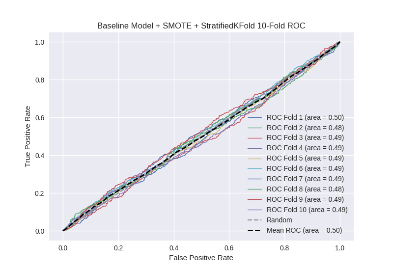

# Baseline Model + SMOTE + StratifiedKFold
**Model Performance Score Report**

### K-Fold Classification Report
| K | Accuracy | Precision | Recall | F-Measure | AUC | Kappa |
| --- | --- | --- | --- | --- | --- | --- |
| 1 | 0.311540648096 | 0.25242091672 | 0.880630630631 | 0.392373306573 | 0.500011132806 | 1.22055699651e-05 |
| 2 | 0.299602046617 | 0.24481865285 | 0.851351351351 | 0.380281690141 | 0.482329668071 | -0.0194127442587 |
| 3 | 0.68732234224 | 0.208791208791 | 0.0855855855856 | 0.121405750799 | 0.488039941082 | -0.0297301382198 |
| 4 | 0.33731513083 | 0.245056497175 | 0.783295711061 | 0.373318988704 | 0.485183977203 | -0.0171458710156 |
| 5 | 0.324232081911 | 0.248480756246 | 0.830699774266 | 0.382536382536 | 0.492155970783 | -0.00882898775303 |
| 6 | 0.274744027304 | 0.248488512696 | 0.92776523702 | 0.391988555079 | 0.491259044366 | -0.00917030528364 |
| 7 | 0.38850967008 | 0.248006379585 | 0.702031602709 | 0.366529169122 | 0.492460668275 | -0.00938320188946 |
| 8 | 0.289533560865 | 0.242327365729 | 0.855530474041 | 0.377678126557 | 0.477194894815 | -0.0248016197129 |
| 9 | 0.331815594764 | 0.249828884326 | 0.823927765237 | 0.383403361345 | 0.494916698448 | -0.00577117552351 |
| 10 | 0.334661354582 | 0.249309392265 | 0.814898419865 | 0.381808566896 | 0.493826683296 | -0.00704760195709 |

### Average Confusion Matrix
| | Pred POS | Pred NEG |
| --- | --- | --- |
| **True POS** | 334.9 | 108.4 |
| **True NEG** | 1020.4 | 294.4 |

### Average Model Performance Metrics
| ACC | PRE | REC | F1 | AUC | KAPP |
| --- | --- | --- | --- | --- | --- |
| 0.357927645729 | 0.243752856638 | 0.755571655177 | 0.355132389775 | 0.489737867914 | -0.0131279440044 |

### AUC/ROC Plot

