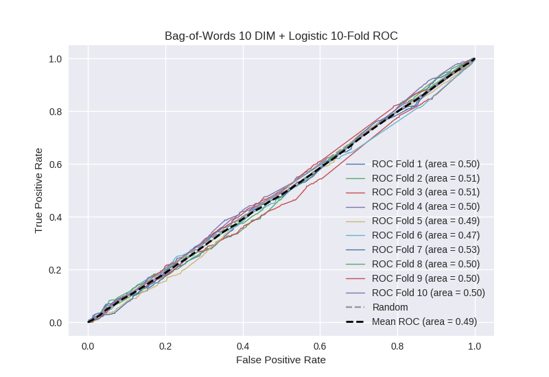

# Bag-of-Words 10 DIM + Logistic
**Model Performance Score Report**

### K-Fold Classification Report
| K | Accuracy | Precision | Recall | F-Measure | AUC | Kappa |
| --- | --- | --- | --- | --- | --- | --- |
| 1 | 0.418419556566 | 0.23370981755 | 0.656097560976 | 0.34465086483 | 0.501139959139 | 0.00139957235906 |
| 2 | 0.440841865757 | 0.273291925466 | 0.652542372881 | 0.385240775485 | 0.507841948494 | 0.0108977228109 |
| 3 | 0.446530147895 | 0.252069917203 | 0.63133640553 | 0.360289283366 | 0.508644033581 | 0.0114817250558 |
| 4 | 0.401023890785 | 0.2585089141 | 0.698030634573 | 0.377291543465 | 0.497362742344 | -0.00339963857159 |
| 5 | 0.442548350398 | 0.251879699248 | 0.592920353982 | 0.353562005277 | 0.49171285693 | -0.0114884762974 |
| 6 | 0.447098976109 | 0.214141414141 | 0.522167487685 | 0.303724928367 | 0.473361850351 | -0.0354410866467 |
| 7 | 0.435722411832 | 0.268416596105 | 0.712359550562 | 0.389913899139 | 0.527162258145 | 0.0351230318609 |
| 8 | 0.416951080774 | 0.256128486898 | 0.676339285714 | 0.371551195586 | 0.502291780262 | 0.00297676683284 |
| 9 | 0.41353811149 | 0.252542372881 | 0.666666666667 | 0.366318377382 | 0.496948893974 | -0.00396156747792 |
| 10 | 0.422639362912 | 0.263473053892 | 0.666666666667 | 0.377682403433 | 0.501157407407 | 0.00155107988061 |

### Average Confusion Matrix
| | Pred POS | Pred NEG |
| --- | --- | --- |
| **True POS** | 287.6 | 155.7 |
| **True NEG** | 849.0 | 465.8 |

### Average Model Performance Metrics
| ACC | PRE | REC | F1 | AUC | KAPP |
| --- | --- | --- | --- | --- | --- |
| 0.428531375452 | 0.252416219749 | 0.647512698524 | 0.363022527633 | 0.500762373063 | 0.000913912980656 |

### AUC/ROC Plot

