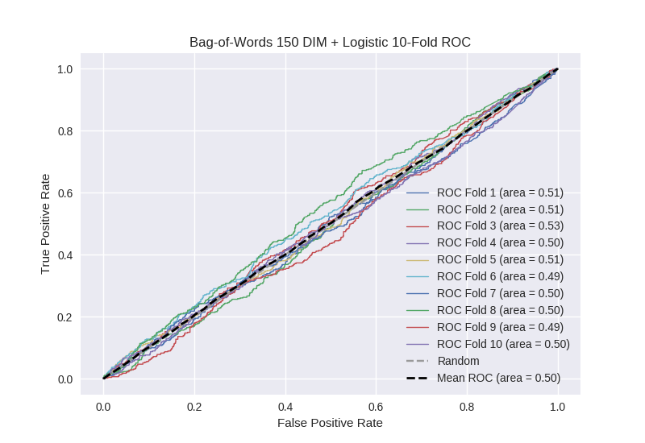

# Bag-of-Words 150 DIM + Logistic
**Model Performance Score Report**

### K-Fold Classification Report
| K | Accuracy | Precision | Recall | F-Measure | AUC | Kappa |
| --- | --- | --- | --- | --- | --- | --- |
| 1 | 0.529846503695 | 0.243542435424 | 0.482926829268 | 0.323793949305 | 0.513516787503 | 0.0201428401108 |
| 2 | 0.525597269625 | 0.273182957393 | 0.46186440678 | 0.343307086614 | 0.505426760155 | 0.00890662643273 |
| 3 | 0.54835039818 | 0.272151898734 | 0.495391705069 | 0.351307189542 | 0.530550837429 | 0.047896692659 |
| 4 | 0.522184300341 | 0.257901390645 | 0.446389496718 | 0.326923076923 | 0.49759905274 | -0.00388168673225 |
| 5 | 0.528441410694 | 0.262295081967 | 0.46017699115 | 0.334136546185 | 0.506122186234 | 0.00982173309834 |
| 6 | 0.511376564278 | 0.221402214022 | 0.443349753695 | 0.295324036095 | 0.487577243711 | -0.0183943578767 |
| 7 | 0.521615472127 | 0.250629722922 | 0.447191011236 | 0.321226795803 | 0.497015155275 | -0.00474073429734 |
| 8 | 0.502844141069 | 0.257403189066 | 0.504464285714 | 0.340874811463 | 0.503377181025 | 0.00513331865684 |
| 9 | 0.5204778157 | 0.25 | 0.442953020134 | 0.319612590799 | 0.494931887641 | -0.0080810059628 |
| 10 | 0.516496018203 | 0.263414634146 | 0.467532467532 | 0.336973478939 | 0.500741542408 | 0.0011871054679 |

### Average Confusion Matrix
| | Pred POS | Pred NEG |
| --- | --- | --- |
| **True POS** | 206.2 | 237.1 |
| **True NEG** | 602.0 | 712.8 |

### Average Model Performance Metrics
| ACC | PRE | REC | F1 | AUC | KAPP |
| --- | --- | --- | --- | --- | --- |
| 0.522722989391 | 0.255192352432 | 0.46522399673 | 0.329347956167 | 0.503685863412 | 0.00579905315566 |

### AUC/ROC Plot

