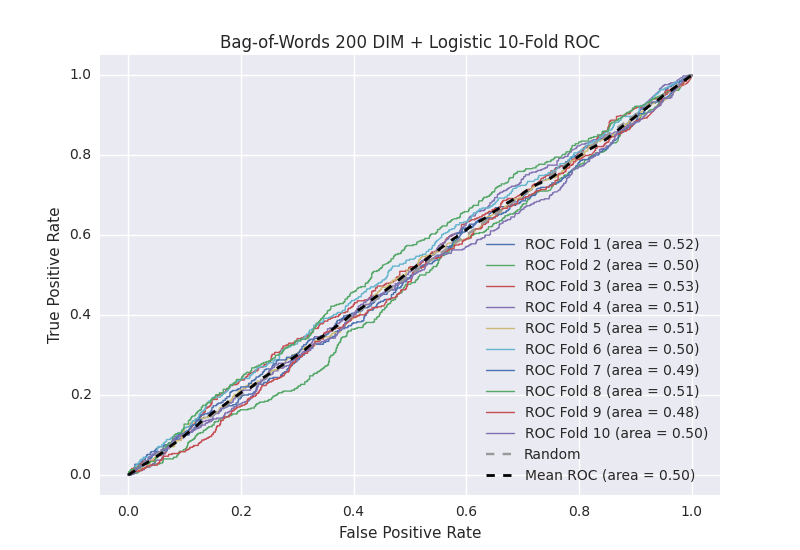

# Bag-of-Words 200 DIM + Logistic
**Model Performance Score Report**

### K-Fold Classification Report
| K | Accuracy | Precision | Recall | F-Measure | AUC | Kappa |
| --- | --- | --- | --- | --- | --- | --- |
| 1 | 0.545196134167 | 0.25 | 0.475609756098 | 0.327731092437 | 0.520977598583 | 0.0319274083145 |
| 2 | 0.546643913538 | 0.272727272727 | 0.41313559322 | 0.328559393429 | 0.504390502675 | 0.00755071944332 |
| 3 | 0.558020477816 | 0.275229357798 | 0.483870967742 | 0.350877192982 | 0.533098625865 | 0.0527557449783 |
| 4 | 0.547781569966 | 0.271002710027 | 0.437636761488 | 0.334728033473 | 0.512054353073 | 0.0200998683286 |
| 5 | 0.544368600683 | 0.265771812081 | 0.438053097345 | 0.330827067669 | 0.509608478228 | 0.0158563535139 |
| 6 | 0.532423208191 | 0.22987012987 | 0.435960591133 | 0.301020408163 | 0.498675561839 | -0.00201640862923 |
| 7 | 0.528441410694 | 0.240540540541 | 0.4 | 0.300421940928 | 0.485986290937 | -0.022989828938 |
| 8 | 0.518771331058 | 0.261961722488 | 0.488839285714 | 0.341121495327 | 0.508923459651 | 0.0138892572417 |
| 9 | 0.532992036405 | 0.239554317549 | 0.384787472036 | 0.295278969957 | 0.484155749748 | -0.026412018962 |
| 10 | 0.54835039818 | 0.265536723164 | 0.406926406926 | 0.321367521368 | 0.502845919513 | 0.00485931097024 |

### Average Confusion Matrix
| | Pred POS | Pred NEG |
| --- | --- | --- |
| **True POS** | 193.2 | 250.1 |
| **True NEG** | 558.1 | 756.7 |

### Average Model Performance Metrics
| ACC | PRE | REC | F1 | AUC | KAPP |
| --- | --- | --- | --- | --- | --- |
| 0.54029890807 | 0.257219458624 | 0.43648199317 | 0.323193311573 | 0.506071654011 | 0.00955204062612 |

### AUC/ROC Plot

