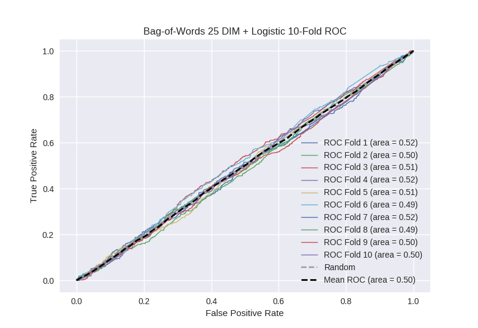

# Bag-of-Words 25 DIM + Logistic
**Model Performance Score Report**

### K-Fold Classification Report
| K | Accuracy | Precision | Recall | F-Measure | AUC | Kappa |
| --- | --- | --- | --- | --- | --- | --- |
| 1 | 0.513928368391 | 0.250280583614 | 0.543902439024 | 0.3428132206 | 0.524360411506 | 0.0345953593407 |
| 2 | 0.497724687144 | 0.268320180383 | 0.504237288136 | 0.350257542311 | 0.499785829138 | -0.000335096024343 |
| 3 | 0.494880546075 | 0.251096491228 | 0.527649769585 | 0.340267459138 | 0.505894371197 | 0.00860380579328 |
| 4 | 0.506257110353 | 0.274917853231 | 0.549234135667 | 0.366423357664 | 0.520197390662 | 0.0305175802965 |
| 5 | 0.499431171786 | 0.261692650334 | 0.519911504425 | 0.348148148148 | 0.506127268292 | 0.00926540241869 |
| 6 | 0.476678043231 | 0.223060344828 | 0.509852216749 | 0.310344827586 | 0.48828409654 | -0.0161619867859 |
| 7 | 0.511376564278 | 0.271017699115 | 0.550561797753 | 0.363232023721 | 0.524328880598 | 0.0362863134356 |
| 8 | 0.470989761092 | 0.24948024948 | 0.535714285714 | 0.340425531915 | 0.492284623773 | -0.0112021810607 |
| 9 | 0.478384527873 | 0.252631578947 | 0.536912751678 | 0.34359341446 | 0.497670716037 | -0.00339842626722 |
| 10 | 0.490898748578 | 0.259176863181 | 0.504329004329 | 0.342395297575 | 0.49522005772 | -0.00732924360516 |

### Average Confusion Matrix
| | Pred POS | Pred NEG |
| --- | --- | --- |
| **True POS** | 234.1 | 209.2 |
| **True NEG** | 680.3 | 634.5 |

### Average Model Performance Metrics
| ACC | PRE | REC | F1 | AUC | KAPP |
| --- | --- | --- | --- | --- | --- |
| 0.49405495288 | 0.256167449434 | 0.528230519306 | 0.344790082312 | 0.505415364546 | 0.00808415275415 |

### AUC/ROC Plot

