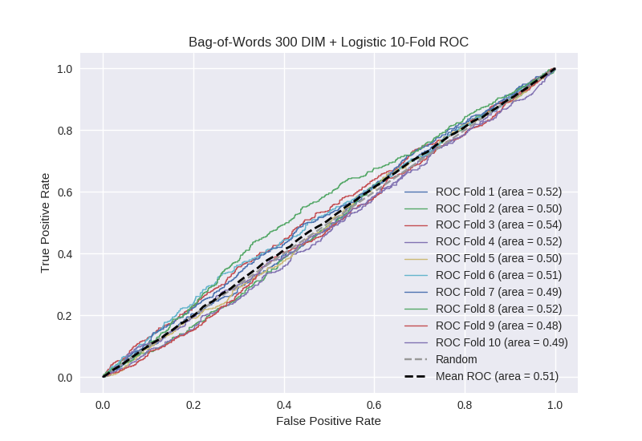

# Bag-of-Words 300 DIM + Logistic
**Model Performance Score Report**

### K-Fold Classification Report
| K | Accuracy | Precision | Recall | F-Measure | AUC | Kappa |
| --- | --- | --- | --- | --- | --- | --- |
| 1 | 0.549744172825 | 0.247354497354 | 0.456097560976 | 0.320754716981 | 0.517151819776 | 0.0265157497097 |
| 2 | 0.532423208191 | 0.266042780749 | 0.421610169492 | 0.326229508197 | 0.497352518649 | -0.00446808392324 |
| 3 | 0.565415244596 | 0.283464566929 | 0.497695852535 | 0.361204013378 | 0.542654572793 | 0.0680289102052 |
| 4 | 0.550056882821 | 0.275537634409 | 0.448577680525 | 0.341382181515 | 0.517140492838 | 0.0284795667283 |
| 5 | 0.531285551763 | 0.260309278351 | 0.446902654867 | 0.328990228013 | 0.503696350405 | 0.00598907583784 |
| 6 | 0.544937428896 | 0.235215053763 | 0.431034482759 | 0.304347826087 | 0.505088247296 | 0.0078810811726 |
| 7 | 0.514220705347 | 0.242118537201 | 0.431460674157 | 0.310177705977 | 0.486865142867 | -0.0208739904014 |
| 8 | 0.529579067122 | 0.26862026862 | 0.491071428571 | 0.34727703236 | 0.516909760087 | 0.0265780730897 |
| 9 | 0.519340159272 | 0.23252688172 | 0.387024608501 | 0.290512174643 | 0.475739611649 | -0.0398056336017 |
| 10 | 0.534698521047 | 0.257493188011 | 0.409090909091 | 0.316053511706 | 0.494283108866 | -0.00961279234347 |

### Average Confusion Matrix
| | Pred POS | Pred NEG |
| --- | --- | --- |
| **True POS** | 195.8 | 247.5 |
| **True NEG** | 566.2 | 748.6 |

### Average Model Performance Metrics
| ACC | PRE | REC | F1 | AUC | KAPP |
| --- | --- | --- | --- | --- | --- |
| 0.537170094188 | 0.256868268711 | 0.442056602147 | 0.324692889886 | 0.505688162523 | 0.00887119564734 |

### AUC/ROC Plot

