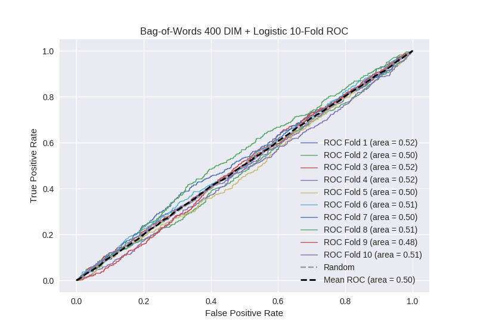

# Bag-of-Words 400 DIM + Logistic
**Model Performance Score Report**

### K-Fold Classification Report
| K | Accuracy | Precision | Recall | F-Measure | AUC | Kappa |
| --- | --- | --- | --- | --- | --- | --- |
| 1 | 0.534963047186 | 0.248768472906 | 0.492682926829 | 0.330605564648 | 0.520248060894 | 0.0301929420392 |
| 2 | 0.526166097838 | 0.270648030496 | 0.451271186441 | 0.338363780778 | 0.502462964916 | 0.00406693716106 |
| 3 | 0.533560864619 | 0.261138613861 | 0.486175115207 | 0.339774557166 | 0.517634385398 | 0.0273478299593 |
| 4 | 0.551194539249 | 0.27807486631 | 0.455142231947 | 0.345228215768 | 0.520038448795 | 0.0332162836181 |
| 5 | 0.522753128555 | 0.25721455458 | 0.453539823009 | 0.328262610088 | 0.500123663419 | 0.000197932017131 |
| 6 | 0.543230944255 | 0.241872561769 | 0.458128078818 | 0.316595744681 | 0.513457530533 | 0.0205020461803 |
| 7 | 0.515927189989 | 0.25243902439 | 0.465168539326 | 0.327272727273 | 0.499149387713 | -0.00133059361342 |
| 8 | 0.528441410694 | 0.266829865361 | 0.486607142857 | 0.344664031621 | 0.51467761723 | 0.0230963415599 |
| 9 | 0.516496018203 | 0.233112582781 | 0.393736017897 | 0.292845257903 | 0.476044210322 | -0.0390461051938 |
| 10 | 0.540386803185 | 0.26747311828 | 0.430735930736 | 0.330016583748 | 0.505105619689 | 0.00853498169879 |

### Average Confusion Matrix
| | Pred POS | Pred NEG |
| --- | --- | --- |
| **True POS** | 202.5 | 240.8 |
| **True NEG** | 583.2 | 731.6 |

### Average Model Performance Metrics
| ACC | PRE | REC | F1 | AUC | KAPP |
| --- | --- | --- | --- | --- | --- |
| 0.531312004377 | 0.257757169073 | 0.457318699307 | 0.329362907367 | 0.506894188891 | 0.0106778595427 |

### AUC/ROC Plot

