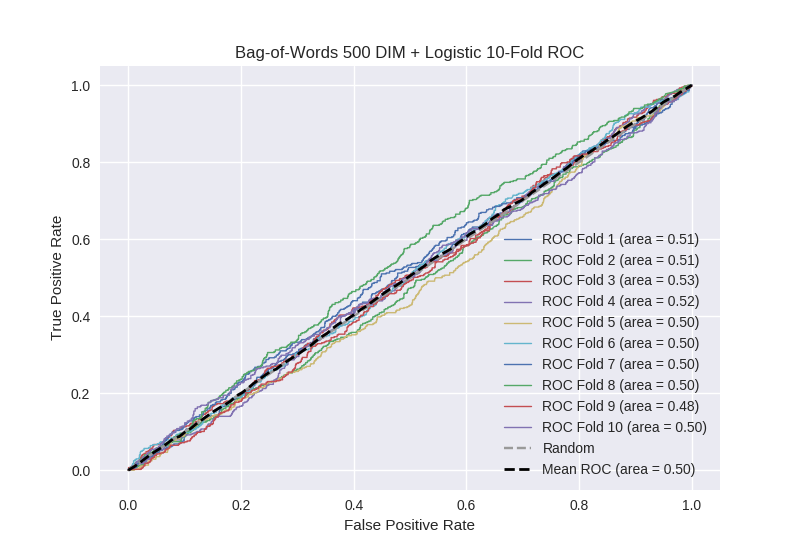

# Bag-of-Words 500 DIM + Logistic
**Model Performance Score Report**

### K-Fold Classification Report
| K | Accuracy | Precision | Recall | F-Measure | AUC | Kappa |
| --- | --- | --- | --- | --- | --- | --- |
| 1 | 0.527572484366 | 0.2423500612 | 0.482926829268 | 0.322738386308 | 0.512034207814 | 0.0178882294724 |
| 2 | 0.533560864619 | 0.276349614396 | 0.455508474576 | 0.344 | 0.508858436355 | 0.0147006154191 |
| 3 | 0.550056882821 | 0.270860077022 | 0.486175115207 | 0.347897774114 | 0.52858604703 | 0.0451176351833 |
| 4 | 0.551194539249 | 0.278666666667 | 0.457330415755 | 0.346313173157 | 0.520748220944 | 0.034352404543 |
| 5 | 0.525597269625 | 0.255128205128 | 0.440265486726 | 0.323051948052 | 0.497697827589 | -0.00372141167192 |
| 6 | 0.536973833902 | 0.232283464567 | 0.435960591133 | 0.303082191781 | 0.50163414172 | 0.00250104558762 |
| 7 | 0.519340159272 | 0.255501222494 | 0.469662921348 | 0.330958036421 | 0.50291980797 | 0.00457270289359 |
| 8 | 0.519908987486 | 0.258536585366 | 0.473214285714 | 0.334384858044 | 0.504546074155 | 0.00714121293555 |
| 9 | 0.513083048919 | 0.232679738562 | 0.398210290828 | 0.293729372937 | 0.475230240761 | -0.0401317126375 |
| 10 | 0.529010238908 | 0.259842519685 | 0.428571428571 | 0.323529411765 | 0.496693121693 | -0.00547073158601 |

### Average Confusion Matrix
| | Pred POS | Pred NEG |
| --- | --- | --- |
| **True POS** | 200.6 | 242.7 |
| **True NEG** | 582.5 | 732.3 |

### Average Model Performance Metrics
| ACC | PRE | REC | F1 | AUC | KAPP |
| --- | --- | --- | --- | --- | --- |
| 0.530629830917 | 0.256219815509 | 0.452782583913 | 0.326968515258 | 0.504894812603 | 0.00769499901391 |

### AUC/ROC Plot

