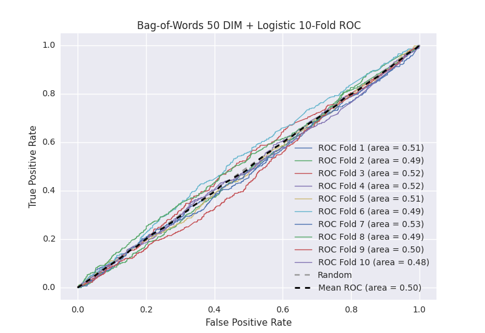

# Bag-of-Words 50 DIM + Logistic
**Model Performance Score Report**

### K-Fold Classification Report
| K | Accuracy | Precision | Recall | F-Measure | AUC | Kappa |
|-|
| 1 | 0.517339397385 | 0.240850059032 | 0.49756097561 | 0.324582338902 | 0.510455802853 | 0.0152533130061 |
| 2 | 0.484072810011 | 0.263329706202 | 0.512711864407 | 0.347951114306 | 0.4931366476 | -0.0105612602529 |
| 3 | 0.52787258248 | 0.265402843602 | 0.516129032258 | 0.350547730829 | 0.523925543319 | 0.0363191584353 |
| 4 | 0.523321956769 | 0.278745644599 | 0.525164113786 | 0.364188163885 | 0.523919489637 | 0.0371782052036 |
| 5 | 0.510807736064 | 0.261682242991 | 0.495575221239 | 0.34250764526 | 0.505827426852 | 0.00901916572717 |
| 6 | 0.491467576792 | 0.220823798627 | 0.475369458128 | 0.3015625 | 0.485835616638 | -0.0201875691311 |
| 7 | 0.534698521047 | 0.276110444178 | 0.516853932584 | 0.359937402191 | 0.528800157457 | 0.0447137351082 |
| 8 | 0.47212741752 | 0.246835443038 | 0.522321428571 | 0.335243553009 | 0.488641630316 | -0.0166155686832 |
| 9 | 0.509670079636 | 0.252681764005 | 0.474272930649 | 0.329704510109 | 0.498006030542 | -0.00309388491066 |
| 10 | 0.481797497156 | 0.248035914703 | 0.478354978355 | 0.326681448633 | 0.480689834857 | -0.0297359334915 |

### Average Confusion Matrix
| | Pred POS | Pred NEG |
|-|
| **True POS** | 222.4 | 220.9 |
| **True NEG** | 648.8 | 666.0 |

### Average Model Performance Metrics
| ACC | PRE | REC | F1 | AUC | KAPP |
|-|
| 0.505317557486 | 0.255449786098 | 0.501431393559 | 0.338290640712 | 0.503923818007 | 0.00622893610111 |

### AUC/ROC Plot

