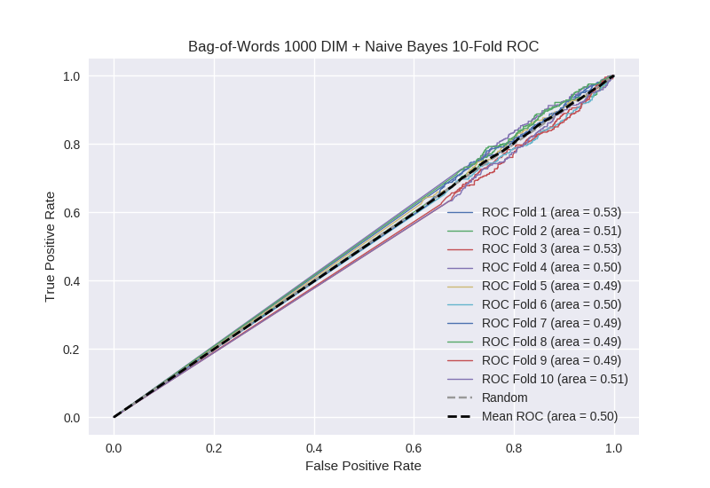

# Bag-of-Words 1000 DIM + Naive Bayes
**Model Performance Score Report**

### K-Fold Classification Report
| K | Accuracy | Precision | Recall | F-Measure | AUC | Kappa |
| --- | --- | --- | --- | --- | --- | --- |
| 1 | 0.438317225696 | 0.249566724437 | 0.70243902439 | 0.368286445013 | 0.530241009601 | 0.0370701176199 |
| 2 | 0.471558589306 | 0.275760549558 | 0.595338983051 | 0.376928236083 | 0.510733255134 | 0.0157059669415 |
| 3 | 0.472696245734 | 0.265906932574 | 0.645161290323 | 0.376597175521 | 0.530662216158 | 0.0414530080429 |
| 4 | 0.44425483504 | 0.257009345794 | 0.601750547046 | 0.360183366077 | 0.495341069065 | -0.00649287483167 |
| 5 | 0.475540386803 | 0.252109704641 | 0.528761061947 | 0.341428571429 | 0.492941021019 | -0.0103901738428 |
| 6 | 0.45164960182 | 0.23275862069 | 0.598522167488 | 0.335172413793 | 0.503033273093 | 0.00391448783688 |
| 7 | 0.466439135381 | 0.245614035088 | 0.534831460674 | 0.336633663366 | 0.48904558563 | -0.0157705854742 |
| 8 | 0.447667804323 | 0.247830279653 | 0.573660714286 | 0.346127946128 | 0.489120433479 | -0.0151890182328 |
| 9 | 0.46188850967 | 0.249246231156 | 0.5548098434 | 0.343966712899 | 0.492507896529 | -0.0106727049309 |
| 10 | 0.4795221843 | 0.271903323263 | 0.584415584416 | 0.371134020619 | 0.513272607023 | 0.0193786966016 |

### Average Confusion Matrix
| | Pred POS | Pred NEG |
| --- | --- | --- |
| **True POS** | 261.9 | 181.4 |
| **True NEG** | 766.3 | 548.5 |

### Average Model Performance Metrics
| ACC | PRE | REC | F1 | AUC | KAPP |
| --- | --- | --- | --- | --- | --- |
| 0.460953451807 | 0.254770574685 | 0.591969067702 | 0.355645855093 | 0.504689836673 | 0.00590069197305 |

### AUC/ROC Plot

