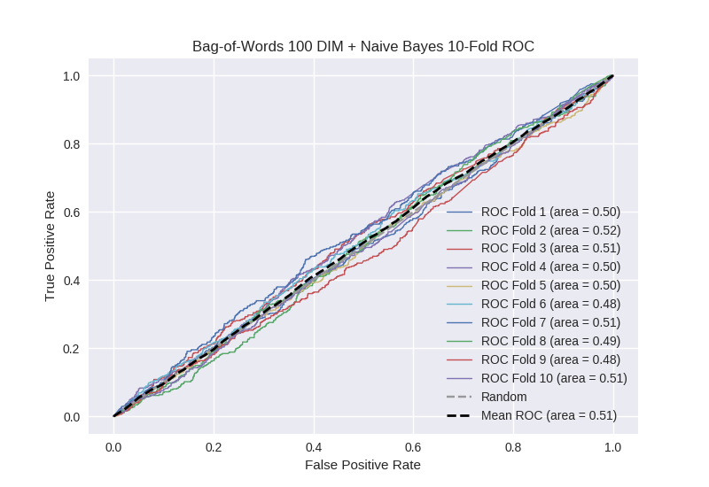

# Bag-of-Words 100 DIM + Naive Bayes
**Model Performance Score Report**

### K-Fold Classification Report
| K | Accuracy | Precision | Recall | F-Measure | AUC | Kappa |
| --- | --- | --- | --- | --- | --- | --- |
| 1 | 0.411028993746 | 0.235194585448 | 0.678048780488 | 0.349246231156 | 0.503961380607 | 0.00478622545721 |
| 2 | 0.48236632537 | 0.281437125749 | 0.597457627119 | 0.38263229308 | 0.518791021957 | 0.0277281445773 |
| 3 | 0.45449374289 | 0.252591894439 | 0.617511520737 | 0.358528428094 | 0.509284461275 | 0.0124995460568 |
| 4 | 0.429465301479 | 0.257548845471 | 0.634573304158 | 0.366392924826 | 0.495995337705 | -0.00543064861012 |
| 5 | 0.603526734926 | 0.263056092843 | 0.300884955752 | 0.280701754386 | 0.50457724051 | 0.00874338866175 |
| 6 | 0.427758816837 | 0.218574108818 | 0.573891625616 | 0.316576086957 | 0.47888368263 | -0.0269216297446 |
| 7 | 0.566552901024 | 0.266568483063 | 0.406741573034 | 0.32206405694 | 0.51372874539 | 0.0233917190719 |
| 8 | 0.525597269625 | 0.25 | 0.430803571429 | 0.316393442623 | 0.494409419302 | -0.00903204849392 |
| 9 | 0.592718998862 | 0.233663366337 | 0.263982102908 | 0.247899159664 | 0.48439379745 | -0.0299325939781 |
| 10 | 0.458475540387 | 0.268867924528 | 0.616883116883 | 0.374507227332 | 0.509444644861 | 0.0133354085163 |

### Average Confusion Matrix
| | Pred POS | Pred NEG |
| --- | --- | --- |
| **True POS** | 226.4 | 216.9 |
| **True NEG** | 670.6 | 644.2 |

### Average Model Performance Metrics
| ACC | PRE | REC | F1 | AUC | KAPP |
| --- | --- | --- | --- | --- | --- |
| 0.495198462515 | 0.25275024267 | 0.512077817812 | 0.331494160506 | 0.501346973169 | 0.00191675115145 |

### AUC/ROC Plot

