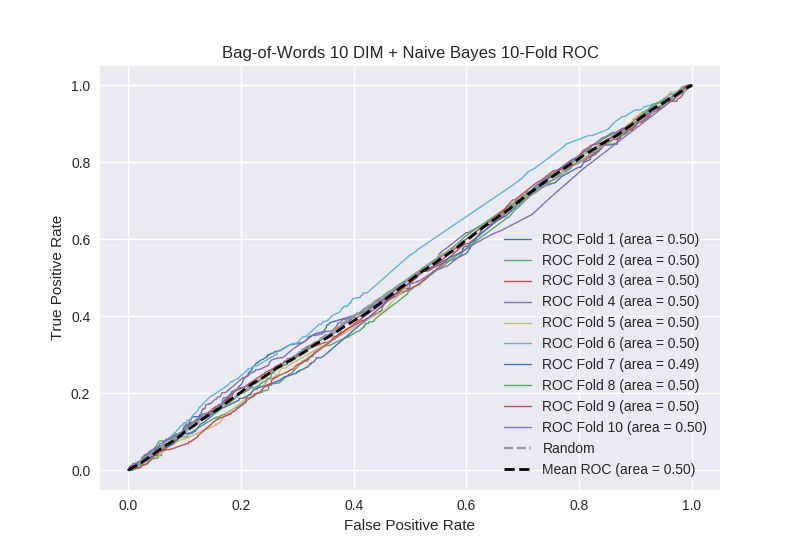

# Bag-of-Words 10 DIM + Naive Bayes
**Model Performance Score Report**

### K-Fold Classification Report
| K | Accuracy | Precision | Recall | F-Measure | AUC | Kappa |
| --- | --- | --- | --- | --- | --- | --- |
| 1 | 0.766913018761 | 0.0 | 0.0 | 0.0 | 0.5 | 0.0 |
| 2 | 0.729806598407 | 0.0 | 0.0 | 0.0 | 0.498833592535 | -0.00340295451432 |
| 3 | 0.751990898749 | 0.25 | 0.00230414746544 | 0.00456621004566 | 0.500019143219 | 5.74013870261e-05 |
| 4 | 0.740045506257 | 0.5 | 0.00218818380744 | 0.00435729847495 | 0.50070977215 | 0.00209664958378 |
| 5 | 0.733219567691 | 0.185185185185 | 0.0110619469027 | 0.0208768267223 | 0.497108308827 | -0.0083505162204 |
| 6 | 0.766780432309 | 0.0 | 0.0 | 0.0 | 0.498520710059 | -0.00452662738387 |
| 7 | 0.737201365188 | 0.0526315789474 | 0.00224719101124 | 0.00431034482759 | 0.494269063899 | -0.0167676094952 |
| 8 | 0.742889647327 | 0.0 | 0.0 | 0.0 | 0.498473282443 | -0.00453079015767 |
| 9 | 0.736632536974 | 0.25 | 0.0178970917226 | 0.0334029227557 | 0.499795227783 | -0.00059006188274 |
| 10 | 0.737201365188 | 0.0 | 0.0 | 0.0 | 0.5 | 0.0 |

### Average Confusion Matrix
| | Pred POS | Pred NEG |
| --- | --- | --- |
| **True POS** | 1.6 | 441.7 |
| **True NEG** | 7.9 | 1306.9 |

### Average Model Performance Metrics
| ACC | PRE | REC | F1 | AUC | KAPP |
| --- | --- | --- | --- | --- | --- |
| 0.744268093685 | 0.123781676413 | 0.00356985609094 | 0.00675136028263 | 0.498772910091 | -0.00360145086834 |

### AUC/ROC Plot

