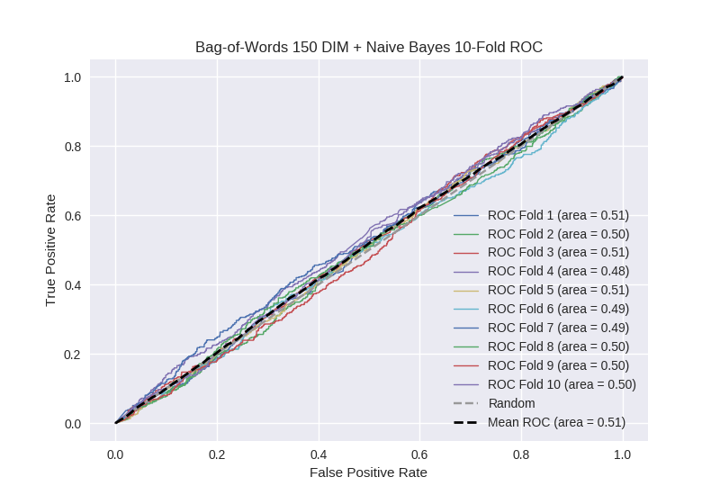

# Bag-of-Words 150 DIM + Naive Bayes
**Model Performance Score Report**

### K-Fold Classification Report
| K | Accuracy | Precision | Recall | F-Measure | AUC | Kappa |
| --- | --- | --- | --- | --- | --- | --- |
| 1 | 0.403069926094 | 0.24025974026 | 0.721951219512 | 0.36053593179 | 0.51405196261 | 0.0165534456704 |
| 2 | 0.415244596132 | 0.269867549669 | 0.690677966102 | 0.388095238095 | 0.502415188339 | 0.00323426110591 |
| 3 | 0.407281001138 | 0.252845528455 | 0.716589861751 | 0.373798076923 | 0.511240550211 | 0.0139077296746 |
| 4 | 0.38850967008 | 0.247960848287 | 0.665207877462 | 0.361259655377 | 0.47826112551 | -0.0281261050513 |
| 5 | 0.456200227531 | 0.263602251407 | 0.621681415929 | 0.37022397892 | 0.510304720216 | 0.0142711351453 |
| 6 | 0.393629124005 | 0.223618090452 | 0.65763546798 | 0.33375 | 0.485992290203 | -0.0166855461375 |
| 7 | 0.414106939704 | 0.248495270851 | 0.649438202247 | 0.359452736318 | 0.491893510872 | -0.0105737601532 |
| 8 | 0.41353811149 | 0.253592561285 | 0.669642857143 | 0.367872470877 | 0.497798527808 | -0.00285946672716 |
| 9 | 0.42662116041 | 0.255448997384 | 0.65548098434 | 0.367628607277 | 0.502034923902 | 0.00268455016057 |
| 10 | 0.412400455063 | 0.261087866109 | 0.675324675325 | 0.376584188292 | 0.496998757415 | -0.00397384823084 |

### Average Confusion Matrix
| | Pred POS | Pred NEG |
| --- | --- | --- |
| **True POS** | 297.9 | 145.4 |
| **True NEG** | 886.5 | 428.3 |

### Average Model Performance Metrics
| ACC | PRE | REC | F1 | AUC | KAPP |
| --- | --- | --- | --- | --- | --- |
| 0.413060121165 | 0.251677870416 | 0.672363052779 | 0.365920088387 | 0.499099155709 | -0.00115676045433 |

### AUC/ROC Plot

