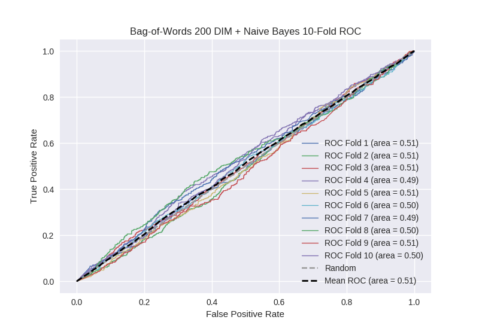

# Bag-of-Words 200 DIM + Naive Bayes
**Model Performance Score Report**

### K-Fold Classification Report
| K | Accuracy | Precision | Recall | F-Measure | AUC | Kappa |
| --- | --- | --- | --- | --- | --- | --- |
| 1 | 0.397384877771 | 0.237055016181 | 0.714634146341 | 0.356014580802 | 0.50779891157 | 0.00916891009324 |
| 2 | 0.42662116041 | 0.272108843537 | 0.677966101695 | 0.388349514563 | 0.506168120832 | 0.00838033843674 |
| 3 | 0.414675767918 | 0.251876563803 | 0.695852534562 | 0.369871402327 | 0.509180043716 | 0.0115295380207 |
| 4 | 0.395335608646 | 0.252854812398 | 0.678336980306 | 0.368389780154 | 0.487131595457 | -0.0166493485298 |
| 5 | 0.483503981797 | 0.261506276151 | 0.553097345133 | 0.355113636364 | 0.506257707788 | 0.00917171516536 |
| 6 | 0.414675767918 | 0.229365768897 | 0.650246305419 | 0.339113680154 | 0.497090608331 | -0.00354378190541 |
| 7 | 0.421501706485 | 0.245551601423 | 0.620224719101 | 0.351816443595 | 0.487187759398 | -0.017033554008 |
| 8 | 0.421501706485 | 0.252823631625 | 0.649553571429 | 0.363977485929 | 0.496532510905 | -0.00457368635749 |
| 9 | 0.436291240046 | 0.259717314488 | 0.657718120805 | 0.37238758708 | 0.509255704186 | 0.0123001983135 |
| 10 | 0.429465301479 | 0.262927256792 | 0.649350649351 | 0.374298190892 | 0.500215448132 | 0.000292551834402 |

### Average Confusion Matrix
| | Pred POS | Pred NEG |
| --- | --- | --- |
| **True POS** | 290.0 | 153.3 |
| **True NEG** | 859.2 | 455.6 |

### Average Model Performance Metrics
| ACC | PRE | REC | F1 | AUC | KAPP |
| --- | --- | --- | --- | --- | --- |
| 0.424095711895 | 0.25257870853 | 0.654698047414 | 0.363933230186 | 0.500681841032 | 0.000904288106322 |

### AUC/ROC Plot

