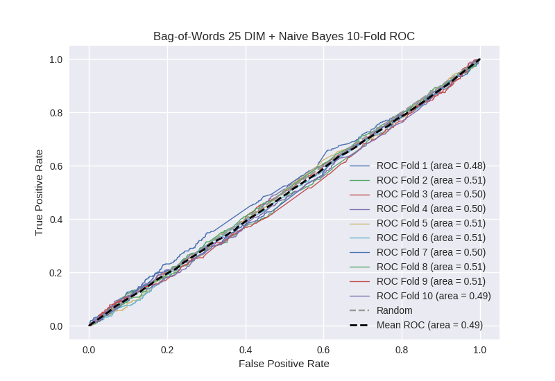

# Bag-of-Words 25 DIM + Naive Bayes
**Model Performance Score Report**

### K-Fold Classification Report
| K | Accuracy | Precision | Recall | F-Measure | AUC | Kappa |
| --- | --- | --- | --- | --- | --- | --- |
| 1 | 0.468447981808 | 0.220447284345 | 0.50487804878 | 0.306893995552 | 0.481126941366 | -0.0260488573601 |
| 2 | 0.67007963595 | 0.284 | 0.150423728814 | 0.196675900277 | 0.505616218995 | 0.0131968612452 |
| 3 | 0.695676905575 | 0.251231527094 | 0.117511520737 | 0.160125588697 | 0.50135394768 | 0.00329786084129 |
| 4 | 0.672354948805 | 0.257142857143 | 0.137855579869 | 0.179487179487 | 0.4989815947 | -0.00239757826776 |
| 5 | 0.697383390216 | 0.3 | 0.132743362832 | 0.184049079755 | 0.512772906531 | 0.0312404186382 |
| 6 | 0.711035267349 | 0.259433962264 | 0.135467980296 | 0.177993527508 | 0.50967185997 | 0.0232265120857 |
| 7 | 0.692832764505 | 0.266009852217 | 0.121348314607 | 0.166666666667 | 0.50393386789 | 0.00959193084295 |
| 8 | 0.686006825939 | 0.277777777778 | 0.145089285714 | 0.190615835777 | 0.508040826063 | 0.0190803119807 |
| 9 | 0.707053469852 | 0.284810126582 | 0.10067114094 | 0.148760330579 | 0.507238697853 | 0.0183967265796 |
| 10 | 0.657565415245 | 0.232824427481 | 0.132034632035 | 0.168508287293 | 0.488471019721 | -0.0267894565268 |

### Average Confusion Matrix
| | Pred POS | Pred NEG |
| --- | --- | --- |
| **True POS** | 73.2 | 370.1 |
| **True NEG** | 217.4 | 1097.4 |

### Average Model Performance Metrics
| ACC | PRE | REC | F1 | AUC | KAPP |
| --- | --- | --- | --- | --- | --- |
| 0.665843660524 | 0.26336778149 | 0.167802359462 | 0.187977639159 | 0.501720788077 | 0.0062794730059 |

### AUC/ROC Plot

