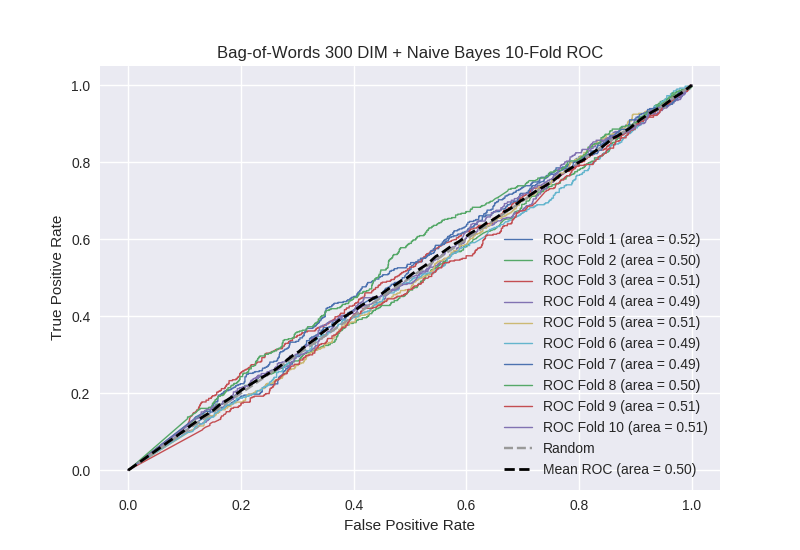

# Bag-of-Words 300 DIM + Naive Bayes
**Model Performance Score Report**

### K-Fold Classification Report
| K | Accuracy | Precision | Recall | F-Measure | AUC | Kappa |
| --- | --- | --- | --- | --- | --- | --- |
| 1 | 0.398521887436 | 0.243264659271 | 0.748780487805 | 0.367224880383 | 0.520424343235 | 0.0237046534271 |
| 2 | 0.420932878271 | 0.267461669506 | 0.665254237288 | 0.381530984204 | 0.498256978675 | -0.00237032124798 |
| 3 | 0.412400455063 | 0.253497942387 | 0.709677419355 | 0.373559733172 | 0.512316051067 | 0.0153487297771 |
| 4 | 0.393629124005 | 0.253441295547 | 0.684901531729 | 0.369976359338 | 0.488107952644 | -0.0153228017289 |
| 5 | 0.50739476678 | 0.265837104072 | 0.519911504425 | 0.351796407186 | 0.511487145781 | 0.0175044141791 |
| 6 | 0.414106939704 | 0.227272727273 | 0.64039408867 | 0.335483870968 | 0.493273967412 | -0.00822284534503 |
| 7 | 0.437997724687 | 0.246024321796 | 0.591011235955 | 0.347424042272 | 0.488574924908 | -0.0156133602931 |
| 8 | 0.437428896473 | 0.256525652565 | 0.636160714286 | 0.36561898653 | 0.50281318157 | 0.00378395041214 |
| 9 | 0.440841865757 | 0.258558558559 | 0.642058165548 | 0.368657675016 | 0.507146550356 | 0.00960073724859 |
| 10 | 0.44425483504 | 0.266121707539 | 0.634199134199 | 0.374920025592 | 0.505371172038 | 0.00743399039545 |

### Average Confusion Matrix
| | Pred POS | Pred NEG |
| --- | --- | --- |
| **True POS** | 286.5 | 156.8 |
| **True NEG** | 844.0 | 470.8 |

### Average Model Performance Metrics
| ACC | PRE | REC | F1 | AUC | KAPP |
| --- | --- | --- | --- | --- | --- |
| 0.430750937322 | 0.253800563851 | 0.647234851926 | 0.363619296466 | 0.502777226769 | 0.00358471468244 |

### AUC/ROC Plot

