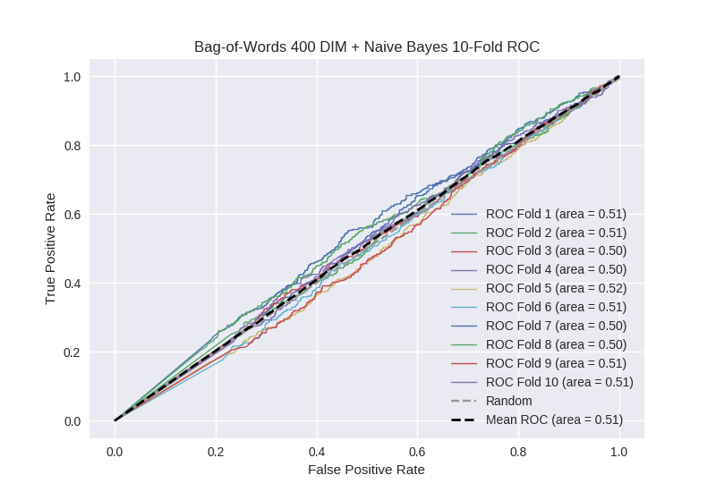

# Bag-of-Words 400 DIM + Naive Bayes
**Model Performance Score Report**

### K-Fold Classification Report
| K | Accuracy | Precision | Recall | F-Measure | AUC | Kappa |
| --- | --- | --- | --- | --- | --- | --- |
| 1 | 0.361000568505 | 0.235555555556 | 0.775609756098 | 0.361363636364 | 0.505299318375 | 0.00589489350576 |
| 2 | 0.415813424346 | 0.274939172749 | 0.718220338983 | 0.397653958944 | 0.511520744919 | 0.0152565835332 |
| 3 | 0.395335608646 | 0.247794707298 | 0.71198156682 | 0.367638310529 | 0.501761176159 | 0.00216146714922 |
| 4 | 0.387372013652 | 0.260432766615 | 0.737417943107 | 0.384922901199 | 0.500914966942 | 0.00114795662665 |
| 5 | 0.463594994312 | 0.267738883633 | 0.62610619469 | 0.375082836315 | 0.516728441909 | 0.0232723382042 |
| 6 | 0.395335608646 | 0.236989591673 | 0.729064039409 | 0.357703927492 | 0.512091191302 | 0.0140072663882 |
| 7 | 0.422639362912 | 0.250437828371 | 0.642696629213 | 0.360428481411 | 0.495377255962 | -0.00609168195601 |
| 8 | 0.411831626849 | 0.253367003367 | 0.671875 | 0.367970660147 | 0.497387881679 | -0.0033847784328 |
| 9 | 0.409556313993 | 0.259951259139 | 0.715883668904 | 0.381406436234 | 0.510497135749 | 0.0133047836878 |
| 10 | 0.427189988623 | 0.268479184367 | 0.683982683983 | 0.385600976205 | 0.509815416065 | 0.013105037646 |

### Average Confusion Matrix
| | Pred POS | Pred NEG |
| --- | --- | --- |
| **True POS** | 310.5 | 132.8 |
| **True NEG** | 906.3 | 408.5 |

### Average Model Performance Metrics
| ACC | PRE | REC | F1 | AUC | KAPP |
| --- | --- | --- | --- | --- | --- |
| 0.408966951048 | 0.255568595277 | 0.701283782121 | 0.373977212484 | 0.506139352906 | 0.00786738663522 |

### AUC/ROC Plot

