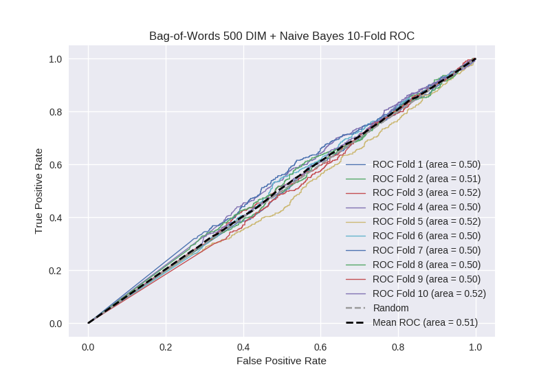

# Bag-of-Words 500 DIM + Naive Bayes
**Model Performance Score Report**

### K-Fold Classification Report
| K | Accuracy | Precision | Recall | F-Measure | AUC | Kappa |
| --- | --- | --- | --- | --- | --- | --- |
| 1 | 0.366117111995 | 0.231530845392 | 0.741463414634 | 0.352872896111 | 0.496750980853 | -0.00367842538011 |
| 2 | 0.42377701934 | 0.275890637945 | 0.705508474576 | 0.396664681358 | 0.512940862483 | 0.0173373342 |
| 3 | 0.420932878271 | 0.255852842809 | 0.705069124424 | 0.375460122699 | 0.516431843179 | 0.0206674794737 |
| 4 | 0.398748577929 | 0.260765550239 | 0.715536105033 | 0.382232612507 | 0.501503640526 | 0.00192074045189 |
| 5 | 0.496018202503 | 0.273958333333 | 0.58185840708 | 0.372521246459 | 0.52408387429 | 0.0352242489111 |
| 6 | 0.405005688282 | 0.232888146912 | 0.687192118227 | 0.347880299252 | 0.503729195208 | 0.00443300040713 |
| 7 | 0.440841865757 | 0.25184501845 | 0.613483146067 | 0.357096141269 | 0.497906843407 | -0.0028388681203 |
| 8 | 0.431171786121 | 0.254884547069 | 0.640625 | 0.364675984752 | 0.500083492366 | 0.000111477901212 |
| 9 | 0.411262798635 | 0.252525252525 | 0.671140939597 | 0.366972477064 | 0.49689770092 | -0.00401267369216 |
| 10 | 0.448805460751 | 0.272237196765 | 0.655844155844 | 0.384761904762 | 0.515422077922 | 0.0212222440558 |

### Average Confusion Matrix
| | Pred POS | Pred NEG |
| --- | --- | --- |
| **True POS** | 297.5 | 145.8 |
| **True NEG** | 866.4 | 448.4 |

### Average Model Performance Metrics
| ACC | PRE | REC | F1 | AUC | KAPP |
| --- | --- | --- | --- | --- | --- |
| 0.424268138958 | 0.256237837144 | 0.671772088548 | 0.370113836623 | 0.506575051115 | 0.00903865582083 |

### AUC/ROC Plot

