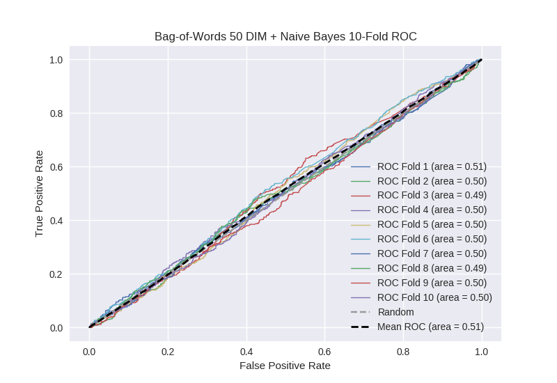

# Bag-of-Words 50 DIM + Naive Bayes
**Model Performance Score Report**

### K-Fold Classification Report
| K | Accuracy | Precision | Recall | F-Measure | AUC | Kappa |
|-|
| 1 | 0.40704945992 | 0.238645747316 | 0.70487804878 | 0.356570018507 | 0.510704406155 | 0.0127437754228 |
| 2 | 0.446530147895 | 0.271232876712 | 0.629237288136 | 0.379068283344 | 0.504354258376 | 0.00614256181781 |
| 3 | 0.473833902162 | 0.242392444911 | 0.532258064516 | 0.333093006489 | 0.493470421986 | -0.00931513175127 |
| 4 | 0.431740614334 | 0.262697022767 | 0.656455142232 | 0.375234521576 | 0.504630338218 | 0.00623113598838 |
| 5 | 0.597838452787 | 0.261682242991 | 0.309734513274 | 0.283687943262 | 0.503642141783 | 0.0068717209506 |
| 6 | 0.415813424346 | 0.228820960699 | 0.645320197044 | 0.337846550613 | 0.496106844084 | -0.0047570339882 |
| 7 | 0.559726962457 | 0.252631578947 | 0.377528089888 | 0.302702702703 | 0.499502811128 | -0.000854707141439 |
| 8 | 0.406712172924 | 0.248945147679 | 0.658482142857 | 0.361298224127 | 0.48954641494 | -0.0135651008759 |
| 9 | 0.624004550626 | 0.255707762557 | 0.250559284116 | 0.253107344633 | 0.500947071501 | 0.00190679385497 |
| 10 | 0.435722411832 | 0.265070921986 | 0.647186147186 | 0.376100628931 | 0.503762826679 | 0.00514105381335 |

### Average Confusion Matrix
| | Pred POS | Pred NEG |
|-|
| **True POS** | 239.3 | 204.0 |
| **True NEG** | 710.4 | 604.4 |

### Average Model Performance Metrics
| ACC | PRE | REC | F1 | AUC | KAPP |
|-|
| 0.479897209928 | 0.252782670657 | 0.541163891803 | 0.335870922418 | 0.500666753485 | 0.00105450680911 |

### AUC/ROC Plot

