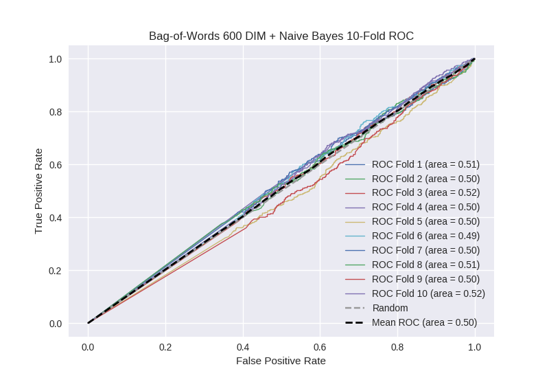

# Bag-of-Words 600 DIM + Naive Bayes
**Model Performance Score Report**

### K-Fold Classification Report
| K | Accuracy | Precision | Recall | F-Measure | AUC | Kappa |
| --- | --- | --- | --- | --- | --- | --- |
| 1 | 0.380898237635 | 0.238645111624 | 0.756097560976 | 0.362785254535 | 0.511480952467 | 0.0130863684864 |
| 2 | 0.41353811149 | 0.270713699754 | 0.699152542373 | 0.390301596688 | 0.503930859056 | 0.0052380790344 |
| 3 | 0.430602957907 | 0.25706940874 | 0.691244239631 | 0.374765771393 | 0.518205201387 | 0.0232259955306 |
| 4 | 0.397042093288 | 0.257831325301 | 0.702407002188 | 0.377203290247 | 0.496092048365 | -0.00501244211746 |
| 5 | 0.483503981797 | 0.258474576271 | 0.53982300885 | 0.349570200573 | 0.501917629999 | 0.00282859984308 |
| 6 | 0.400455062571 | 0.227272727273 | 0.665024630542 | 0.338770388959 | 0.493015273851 | -0.00834568642944 |
| 7 | 0.445961319681 | 0.251643192488 | 0.602247191011 | 0.354966887417 | 0.49762016824 | -0.00325886344061 |
| 8 | 0.434584755404 | 0.259683098592 | 0.658482142857 | 0.372474747475 | 0.508248705016 | 0.0109598283013 |
| 9 | 0.418657565415 | 0.252368647717 | 0.65548098434 | 0.364427860697 | 0.496695488356 | -0.00432996260334 |
| 10 | 0.463594994312 | 0.275862068966 | 0.640692640693 | 0.385667752443 | 0.520577801828 | 0.028870385536 |

### Average Confusion Matrix
| | Pred POS | Pred NEG |
| --- | --- | --- |
| **True POS** | 292.7 | 150.6 |
| **True NEG** | 857.0 | 457.8 |

### Average Model Performance Metrics
| ACC | PRE | REC | F1 | AUC | KAPP |
| --- | --- | --- | --- | --- | --- |
| 0.42688390795 | 0.254956385673 | 0.661065194346 | 0.367093375043 | 0.504778412856 | 0.00632623021409 |

### AUC/ROC Plot

