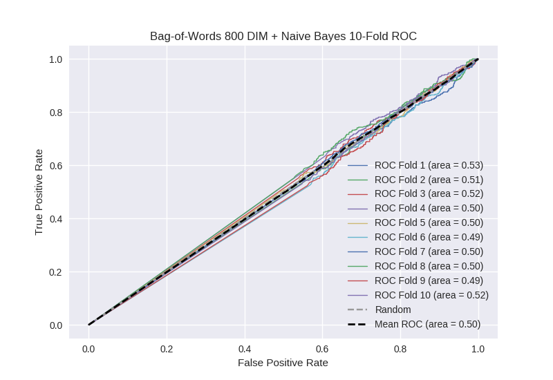

# Bag-of-Words 800 DIM + Naive Bayes
**Model Performance Score Report**

### K-Fold Classification Report
| K | Accuracy | Precision | Recall | F-Measure | AUC | Kappa |
| --- | --- | --- | --- | --- | --- | --- |
| 1 | 0.419556566231 | 0.247311827957 | 0.729268292683 | 0.369363804818 | 0.527347267172 | 0.0325903166327 |
| 2 | 0.442548350398 | 0.274422735346 | 0.654661016949 | 0.386733416771 | 0.509678875504 | 0.0134567151872 |
| 3 | 0.451080773606 | 0.260162601626 | 0.663594470046 | 0.373783257625 | 0.522507204812 | 0.029591546057 |
| 4 | 0.429465301479 | 0.259683098592 | 0.645514223195 | 0.37037037037 | 0.499544198454 | -0.000615143656473 |
| 5 | 0.481228668942 | 0.257383966245 | 0.53982300885 | 0.348571428571 | 0.500386236431 | 0.000568504832291 |
| 6 | 0.429465301479 | 0.223866790009 | 0.5960591133 | 0.325487558843 | 0.487748491561 | -0.0154920541312 |
| 7 | 0.471558589306 | 0.252049180328 | 0.552808988764 | 0.346235045742 | 0.498415156987 | -0.00227312059445 |
| 8 | 0.443117178612 | 0.252562907735 | 0.604910714286 | 0.356344510191 | 0.496348486914 | -0.00500551821595 |
| 9 | 0.449943117179 | 0.250479846449 | 0.58389261745 | 0.350570852921 | 0.494082082943 | -0.00822720171946 |
| 10 | 0.473265073948 | 0.274319066148 | 0.61038961039 | 0.378523489933 | 0.517386163219 | 0.0249408822028 |

### Average Confusion Matrix
| | Pred POS | Pred NEG |
| --- | --- | --- |
| **True POS** | 273.7 | 169.6 |
| **True NEG** | 798.9 | 515.9 |

### Average Model Performance Metrics
| ACC | PRE | REC | F1 | AUC | KAPP |
| --- | --- | --- | --- | --- | --- |
| 0.449122892118 | 0.255224202044 | 0.618092205591 | 0.360598373579 | 0.5053444164 | 0.00695349265946 |

### AUC/ROC Plot

