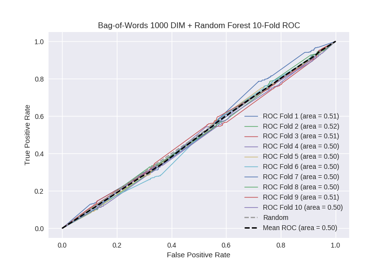

# Bag-of-Words 1000 DIM + Random Forest
**Model Performance Score Report**

### K-Fold Classification Report
| K | Accuracy | Precision | Recall | F-Measure | AUC | Kappa |
| --- | --- | --- | --- | --- | --- | --- |
| 1 | 0.737919272314 | 0.274336283186 | 0.0756097560976 | 0.118546845124 | 0.507411994431 | 0.0198211766754 |
| 2 | 0.712741751991 | 0.361344537815 | 0.0911016949153 | 0.14551607445 | 0.516001858344 | 0.041927734767 |
| 3 | 0.724687144482 | 0.276785714286 | 0.0714285714286 | 0.113553113553 | 0.505125161847 | 0.0136555644686 |
| 4 | 0.706484641638 | 0.238938053097 | 0.0590809628009 | 0.0947368421053 | 0.496488982553 | -0.00929039206567 |
| 5 | 0.707053469852 | 0.230769230769 | 0.0597345132743 | 0.0949033391916 | 0.495410901354 | -0.0121135697469 |
| 6 | 0.737201365188 | 0.25 | 0.0689655172414 | 0.108108108108 | 0.503417669863 | 0.00915456874466 |
| 7 | 0.713310580205 | 0.234234234234 | 0.0584269662921 | 0.0935251798561 | 0.496844861669 | -0.00839234377881 |
| 8 | 0.705915813424 | 0.251798561151 | 0.078125 | 0.119250425894 | 0.499367843511 | -0.00163543831731 |
| 9 | 0.720136518771 | 0.304347826087 | 0.0782997762864 | 0.124555160142 | 0.508638827884 | 0.0228765479797 |
| 10 | 0.707053469852 | 0.280991735537 | 0.0735930735931 | 0.116638078902 | 0.503231721982 | 0.00847652528173 |

### Average Confusion Matrix
| | Pred POS | Pred NEG |
| --- | --- | --- |
| **True POS** | 31.7 | 411.6 |
| **True NEG** | 85.5 | 1229.3 |

### Average Model Performance Metrics
| ACC | PRE | REC | F1 | AUC | KAPP |
| --- | --- | --- | --- | --- | --- |
| 0.717250402772 | 0.270354617616 | 0.071436583193 | 0.112933316733 | 0.503193982344 | 0.00844803740085 |

### AUC/ROC Plot

