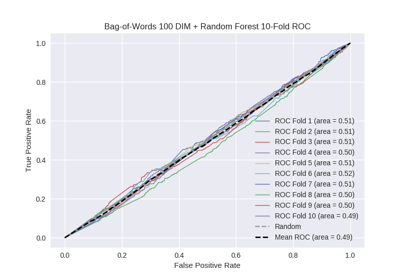

# Bag-of-Words 100 DIM + Random Forest
**Model Performance Score Report**

### K-Fold Classification Report
| K | Accuracy | Precision | Recall | F-Measure | AUC | Kappa |
| --- | --- | --- | --- | --- | --- | --- |
| 1 | 0.724275156339 | 0.280701754386 | 0.117073170732 | 0.165232358003 | 0.51294725994 | 0.0324850667813 |
| 2 | 0.696814562002 | 0.310559006211 | 0.10593220339 | 0.157977883096 | 0.50980902549 | 0.0247869029901 |
| 3 | 0.708759954494 | 0.285714285714 | 0.119815668203 | 0.168831168831 | 0.510814178512 | 0.026872745829 |
| 4 | 0.689419795222 | 0.248587570621 | 0.0962800875274 | 0.13880126183 | 0.497025516477 | -0.00742448000302 |
| 5 | 0.703071672355 | 0.283950617284 | 0.101769911504 | 0.14983713355 | 0.506474542276 | 0.016386484366 |
| 6 | 0.718998862344 | 0.28 | 0.137931034483 | 0.184818481848 | 0.515711079372 | 0.0382037503821 |
| 7 | 0.705915813424 | 0.297752808989 | 0.119101123596 | 0.170144462279 | 0.51194964786 | 0.0298116808673 |
| 8 | 0.700796359499 | 0.265060240964 | 0.0982142857143 | 0.14332247557 | 0.502542257361 | 0.00641254314068 |
| 9 | 0.698521046644 | 0.270718232044 | 0.109619686801 | 0.156050955414 | 0.504466593973 | 0.0111121724456 |
| 10 | 0.684869169511 | 0.241573033708 | 0.0930735930736 | 0.134375 | 0.494453463203 | -0.013828165988 |

### Average Confusion Matrix
| | Pred POS | Pred NEG |
| --- | --- | --- |
| **True POS** | 48.5 | 394.8 |
| **True NEG** | 127.1 | 1187.7 |

### Average Model Performance Metrics
| ACC | PRE | REC | F1 | AUC | KAPP |
| --- | --- | --- | --- | --- | --- |
| 0.703144239183 | 0.276461754992 | 0.109881076502 | 0.156939118042 | 0.506619356446 | 0.0164818700811 |

### AUC/ROC Plot

