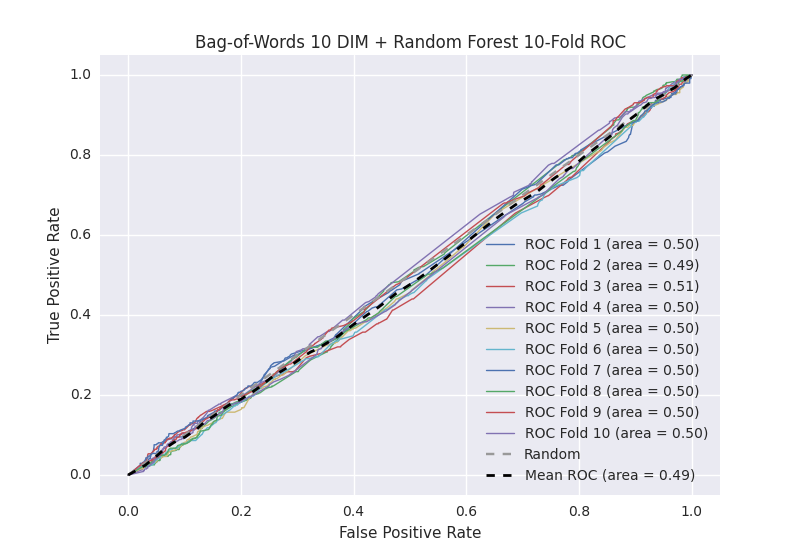

# Bag-of-Words 10 DIM + Random Forest
**Model Performance Score Report**

### K-Fold Classification Report
| K | Accuracy | Precision | Recall | F-Measure | AUC | Kappa |
|-|
| 1 | 0.758385446276 | 0.272727272727 | 0.0219512195122 | 0.0406320541761 | 0.502080131624 | 0.00611824078641 |
| 2 | 0.720136518771 | 0.142857142857 | 0.00847457627119 | 0.016 | 0.494906028416 | -0.014506760751 |
| 3 | 0.750853242321 | 0.423076923077 | 0.0253456221198 | 0.0478260869565 | 0.507008158492 | 0.0204907188798 |
| 4 | 0.734357224118 | 0.291666666667 | 0.0153172866521 | 0.029106029106 | 0.501125207507 | 0.00324890549764 |
| 5 | 0.736632536974 | 0.296296296296 | 0.0176991150442 | 0.0334029227557 | 0.501575438073 | 0.0045494903837 |
| 6 | 0.764505119454 | 0.3 | 0.0147783251232 | 0.0281690140845 | 0.502211647769 | 0.00662783143252 |
| 7 | 0.736632536974 | 0.235294117647 | 0.0179775280899 | 0.0334029227557 | 0.499087773946 | -0.00262619145576 |
| 8 | 0.738907849829 | 0.322580645161 | 0.0223214285714 | 0.0417536534447 | 0.50314544711 | 0.00906784427476 |
| 9 | 0.733219567691 | 0.225 | 0.0201342281879 | 0.0369609856263 | 0.498244078243 | -0.00501715046332 |
| 10 | 0.732081911263 | 0.32 | 0.017316017316 | 0.0328542094456 | 0.502099366683 | 0.00603568110284 |

### Average Confusion Matrix
| | Pred POS | Pred NEG |
|-|
| **True POS** | 8.0 | 435.3 |
| **True NEG** | 20.8 | 1294.0 |

### Average Model Performance Metrics
| ACC | PRE | REC | F1 | AUC | KAPP |
|-|
| 0.740571195367 | 0.282949906443 | 0.0181315346888 | 0.0340107878351 | 0.501148327786 | 0.00339886096875 |

### AUC/ROC Plot

