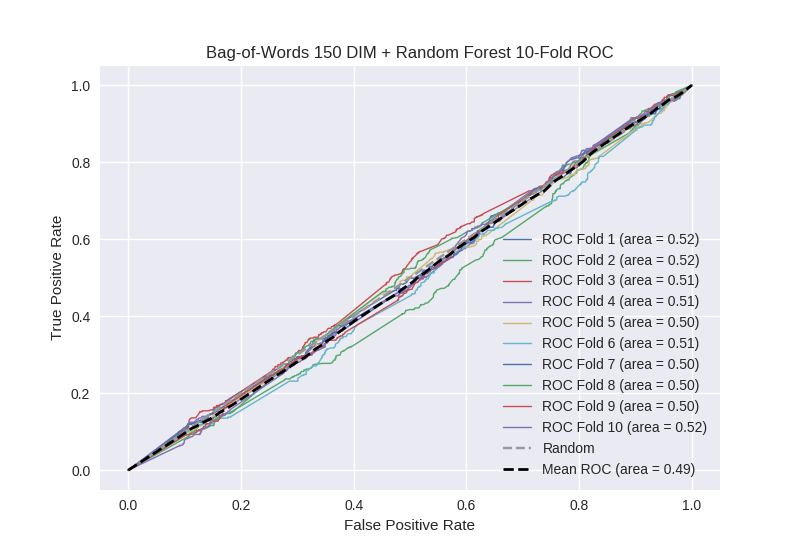

# Bag-of-Words 150 DIM + Random Forest
**Model Performance Score Report**

### K-Fold Classification Report
| K | Accuracy | Precision | Recall | F-Measure | AUC | Kappa |
| --- | --- | --- | --- | --- | --- | --- |
| 1 | 0.733371233655 | 0.314465408805 | 0.121951219512 | 0.175746924429 | 0.52057531324 | 0.0522923269741 |
| 2 | 0.699089874858 | 0.337142857143 | 0.125 | 0.182380216383 | 0.517398911353 | 0.0434508025912 |
| 3 | 0.707622298066 | 0.277777777778 | 0.115207373272 | 0.162866449511 | 0.508510031047 | 0.0211878176548 |
| 4 | 0.706484641638 | 0.299319727891 | 0.0962800875274 | 0.145695364238 | 0.508555109098 | 0.0219370030858 |
| 5 | 0.693970420933 | 0.258426966292 | 0.101769911504 | 0.146031746032 | 0.500348968003 | 0.000870458089133 |
| 6 | 0.722411831627 | 0.274725274725 | 0.12315270936 | 0.170068027211 | 0.512759786632 | 0.0316236229005 |
| 7 | 0.707053469852 | 0.266666666667 | 0.0898876404494 | 0.134453781513 | 0.50305501596 | 0.00782457178551 |
| 8 | 0.702502844141 | 0.267080745342 | 0.0959821428571 | 0.141215106732 | 0.50295290349 | 0.00748300347811 |
| 9 | 0.708759954494 | 0.275862068966 | 0.089485458613 | 0.135135135135 | 0.504696962716 | 0.012084214131 |
| 10 | 0.702502844141 | 0.323699421965 | 0.121212121212 | 0.176377952756 | 0.515467171717 | 0.0387295891803 |

### Average Confusion Matrix
| | Pred POS | Pred NEG |
| --- | --- | --- |
| **True POS** | 47.8 | 395.5 |
| **True NEG** | 117.2 | 1197.6 |

### Average Model Performance Metrics
| ACC | PRE | REC | F1 | AUC | KAPP |
| --- | --- | --- | --- | --- | --- |
| 0.708376941341 | 0.289516691557 | 0.107992866431 | 0.156997070394 | 0.509432017326 | 0.023748340987 |

### AUC/ROC Plot

