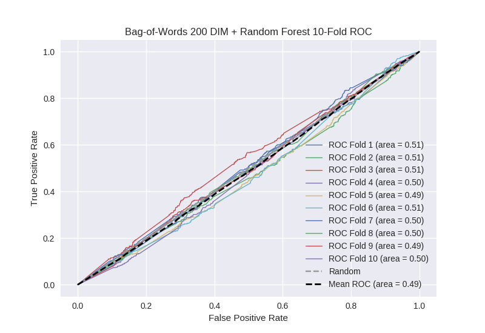

# Bag-of-Words 200 DIM + Random Forest
**Model Performance Score Report**

### K-Fold Classification Report
| K | Accuracy | Precision | Recall | F-Measure | AUC | Kappa |
| --- | --- | --- | --- | --- | --- | --- |
| 1 | 0.721432632177 | 0.259036144578 | 0.10487804878 | 0.149305555556 | 0.506849698964 | 0.0172781005719 |
| 2 | 0.685437997725 | 0.292307692308 | 0.120762711864 | 0.170914542729 | 0.506726612542 | 0.0165219027502 |
| 3 | 0.708759954494 | 0.280898876404 | 0.115207373272 | 0.16339869281 | 0.509265318056 | 0.0231128553319 |
| 4 | 0.699658703072 | 0.270967741935 | 0.0919037199125 | 0.137254901961 | 0.50252372775 | 0.00642456964375 |
| 5 | 0.697383390216 | 0.233333333333 | 0.0774336283186 | 0.116279069767 | 0.494689249075 | -0.0135903138127 |
| 6 | 0.722980659841 | 0.27374301676 | 0.120689655172 | 0.167521367521 | 0.512267904509 | 0.0305022636629 |
| 7 | 0.695108077361 | 0.24 | 0.0943820224719 | 0.135483870968 | 0.496543638806 | -0.00864687811092 |
| 8 | 0.689988623436 | 0.251282051282 | 0.109375 | 0.152410575428 | 0.49896230916 | -0.00254898636983 |
| 9 | 0.697383390216 | 0.218543046358 | 0.0738255033557 | 0.110367892977 | 0.491908937795 | -0.0206986870969 |
| 10 | 0.693401592719 | 0.272189349112 | 0.0995670995671 | 0.145800316957 | 0.50232984608 | 0.00585432181144 |

### Average Confusion Matrix
| | Pred POS | Pred NEG |
| --- | --- | --- |
| **True POS** | 44.6 | 398.7 |
| **True NEG** | 126.7 | 1188.1 |

### Average Model Performance Metrics
| ACC | PRE | REC | F1 | AUC | KAPP |
| --- | --- | --- | --- | --- | --- |
| 0.701153502126 | 0.259230125207 | 0.100802476271 | 0.144873678667 | 0.502206724274 | 0.00542091483819 |

### AUC/ROC Plot

