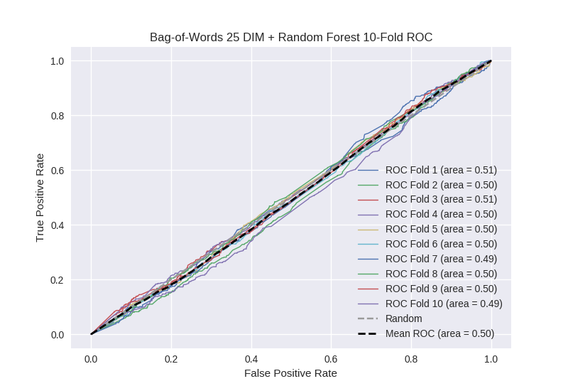

# Bag-of-Words 25 DIM + Random Forest
**Model Performance Score Report**

### K-Fold Classification Report
| K | Accuracy | Precision | Recall | F-Measure | AUC | Kappa |
| --- | --- | --- | --- | --- | --- | --- |
| 1 | 0.740761796475 | 0.290909090909 | 0.0780487804878 | 0.123076923077 | 0.510114086315 | 0.0271395303707 |
| 2 | 0.70534698521 | 0.27 | 0.0572033898305 | 0.0944055944056 | 0.500219113267 | 0.000583860856739 |
| 3 | 0.730375426621 | 0.3 | 0.0691244239631 | 0.112359550562 | 0.508127166664 | 0.0219256031888 |
| 4 | 0.715017064846 | 0.265957446809 | 0.054704595186 | 0.0907441016334 | 0.500834234565 | 0.00224754231701 |
| 5 | 0.721274175199 | 0.2625 | 0.0464601769912 | 0.0789473684211 | 0.500642033365 | 0.00175679308778 |
| 6 | 0.739476678043 | 0.211111111111 | 0.0467980295567 | 0.0766129032258 | 0.497141618329 | -0.00785591972842 |
| 7 | 0.712741751991 | 0.18085106383 | 0.038202247191 | 0.0630797773655 | 0.48977896061 | -0.0276512845207 |
| 8 | 0.721274175199 | 0.28125 | 0.0602678571429 | 0.0992647058824 | 0.503798050709 | 0.0102443194353 |
| 9 | 0.715017064846 | 0.224489795918 | 0.0492170022371 | 0.0807339449541 | 0.495622993872 | -0.0117863567751 |
| 10 | 0.708759954494 | 0.222222222222 | 0.04329004329 | 0.0724637681159 | 0.494638848806 | -0.0144715843004 |

### Average Confusion Matrix
| | Pred POS | Pred NEG |
| --- | --- | --- |
| **True POS** | 24.0 | 419.3 |
| **True NEG** | 71.2 | 1243.6 |

### Average Model Performance Metrics
| ACC | PRE | REC | F1 | AUC | KAPP |
| --- | --- | --- | --- | --- | --- |
| 0.721004507293 | 0.25092907308 | 0.0543316545876 | 0.0891688637642 | 0.50009171065 | 0.000213250393171 |

### AUC/ROC Plot

