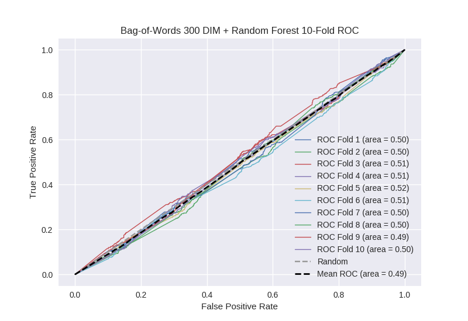

# Bag-of-Words 300 DIM + Random Forest
**Model Performance Score Report**

### K-Fold Classification Report
| K | Accuracy | Precision | Recall | F-Measure | AUC | Kappa |
| --- | --- | --- | --- | --- | --- | --- |
| 1 | 0.715179079022 | 0.213836477987 | 0.0829268292683 | 0.119507908612 | 0.495132799364 | -0.0123700302473 |
| 2 | 0.686006825939 | 0.261904761905 | 0.0932203389831 | 0.1375 | 0.498398660938 | -0.00402264600715 |
| 3 | 0.711604095563 | 0.276073619632 | 0.103686635945 | 0.150753768844 | 0.507281384438 | 0.0184308655327 |
| 4 | 0.703640500569 | 0.307228915663 | 0.111597374179 | 0.163723916533 | 0.511601915376 | 0.0292439931744 |
| 5 | 0.719567690557 | 0.350364963504 | 0.106194690265 | 0.16298811545 | 0.519023838241 | 0.0492752414948 |
| 6 | 0.719567690557 | 0.251428571429 | 0.108374384236 | 0.151462994836 | 0.505740446556 | 0.0143341620247 |
| 7 | 0.697383390216 | 0.248554913295 | 0.0966292134831 | 0.139158576052 | 0.498809656247 | -0.00298346120106 |
| 8 | 0.69795221843 | 0.268156424581 | 0.107142857143 | 0.153110047847 | 0.503571428571 | 0.00890132734249 |
| 9 | 0.693970420933 | 0.194630872483 | 0.0648769574944 | 0.0973154362416 | 0.486671888358 | -0.0341606145893 |
| 10 | 0.695108077361 | 0.279761904762 | 0.101731601732 | 0.149206349206 | 0.5041837021 | 0.0105218059703 |

### Average Confusion Matrix
| | Pred POS | Pred NEG |
| --- | --- | --- |
| **True POS** | 43.3 | 400.0 |
| **True NEG** | 120.4 | 1194.4 |

### Average Model Performance Metrics
| ACC | PRE | REC | F1 | AUC | KAPP |
| --- | --- | --- | --- | --- | --- |
| 0.703997998915 | 0.265194142524 | 0.0976380882729 | 0.142472711362 | 0.503041572019 | 0.00771706434946 |

### AUC/ROC Plot

