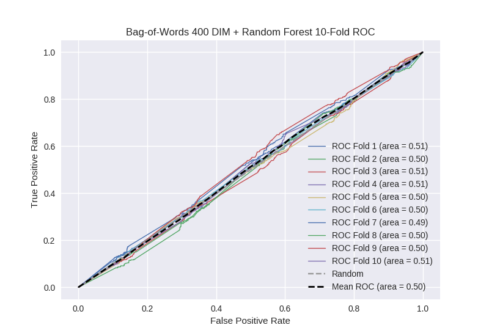

# Bag-of-Words 400 DIM + Random Forest
**Model Performance Score Report**

### K-Fold Classification Report
| K | Accuracy | Precision | Recall | F-Measure | AUC | Kappa |
| --- | --- | --- | --- | --- | --- | --- |
| 1 | 0.7271176805 | 0.266666666667 | 0.0975609756098 | 0.142857142857 | 0.508009546367 | 0.0205558906779 |
| 2 | 0.693401592719 | 0.289308176101 | 0.0974576271186 | 0.145800316957 | 0.504794132377 | 0.0121350872913 |
| 3 | 0.721274175199 | 0.297101449275 | 0.0944700460829 | 0.143356643357 | 0.510603603102 | 0.0275143600303 |
| 4 | 0.712172923777 | 0.304 | 0.0831509846827 | 0.13058419244 | 0.50813967374 | 0.0212981320401 |
| 5 | 0.703640500569 | 0.236641221374 | 0.0685840707965 | 0.106346483705 | 0.496007196195 | -0.0104005559907 |
| 6 | 0.726393629124 | 0.237762237762 | 0.0837438423645 | 0.123861566485 | 0.501561270295 | 0.00403756775411 |
| 7 | 0.701365187713 | 0.222222222222 | 0.0719101123596 | 0.108658743633 | 0.493304637292 | -0.0172467381313 |
| 8 | 0.699089874858 | 0.248447204969 | 0.0892857142857 | 0.131362889984 | 0.498459651036 | -0.00390342478027 |
| 9 | 0.70534698521 | 0.233082706767 | 0.0693512304251 | 0.106896551724 | 0.495774013382 | -0.0109976485948 |
| 10 | 0.707053469852 | 0.314685314685 | 0.0974025974026 | 0.148760330579 | 0.510892656726 | 0.0280077040511 |

### Average Confusion Matrix
| | Pred POS | Pred NEG |
| --- | --- | --- |
| **True POS** | 37.8 | 405.5 |
| **True NEG** | 104.9 | 1209.9 |

### Average Model Performance Metrics
| ACC | PRE | REC | F1 | AUC | KAPP |
| --- | --- | --- | --- | --- | --- |
| 0.709685601952 | 0.264991719982 | 0.0852917201128 | 0.128848486172 | 0.502754638051 | 0.00710003743477 |

### AUC/ROC Plot

