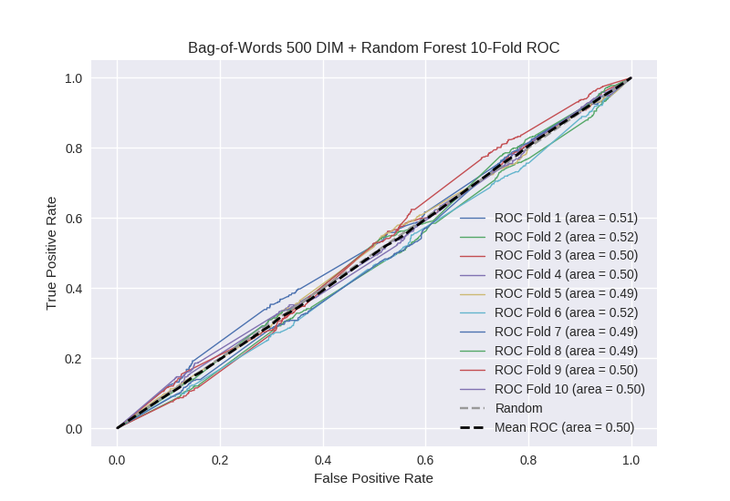

# Bag-of-Words 500 DIM + Random Forest
**Model Performance Score Report**

### K-Fold Classification Report
| K | Accuracy | Precision | Recall | F-Measure | AUC | Kappa |
| --- | --- | --- | --- | --- | --- | --- |
| 1 | 0.729391699829 | 0.257352941176 | 0.0853658536585 | 0.128205128205 | 0.505247789691 | 0.0136766192245 |
| 2 | 0.702502844141 | 0.335483870968 | 0.110169491525 | 0.165869218501 | 0.515038089464 | 0.0381946260563 |
| 3 | 0.722411831627 | 0.263157894737 | 0.0691244239631 | 0.109489051095 | 0.502840157601 | 0.00755177966572 |
| 4 | 0.707622298066 | 0.279069767442 | 0.0787746170678 | 0.122866894198 | 0.503645571409 | 0.00950364032174 |
| 5 | 0.700227531286 | 0.230215827338 | 0.070796460177 | 0.108291032149 | 0.494433452141 | -0.0143914194556 |
| 6 | 0.738907849829 | 0.309352517986 | 0.105911330049 | 0.157798165138 | 0.517452706445 | 0.045336128588 |
| 7 | 0.703640500569 | 0.220588235294 | 0.0674157303371 | 0.103270223752 | 0.493342290149 | -0.0172820144876 |
| 8 | 0.693970420933 | 0.228915662651 | 0.0848214285714 | 0.123778501629 | 0.493555752454 | -0.0162548513124 |
| 9 | 0.709897610922 | 0.266666666667 | 0.0805369127517 | 0.123711340206 | 0.502511019305 | 0.00652212936554 |
| 10 | 0.696245733788 | 0.25 | 0.0779220779221 | 0.118811881188 | 0.497294372294 | -0.00695061204 |

### Average Confusion Matrix
| | Pred POS | Pred NEG |
| --- | --- | --- |
| **True POS** | 36.8 | 406.5 |
| **True NEG** | 102.5 | 1212.3 |

### Average Model Performance Metrics
| ACC | PRE | REC | F1 | AUC | KAPP |
| --- | --- | --- | --- | --- | --- |
| 0.710481832099 | 0.264080338426 | 0.0830838326023 | 0.126209143606 | 0.502536120095 | 0.00659060259263 |

### AUC/ROC Plot

