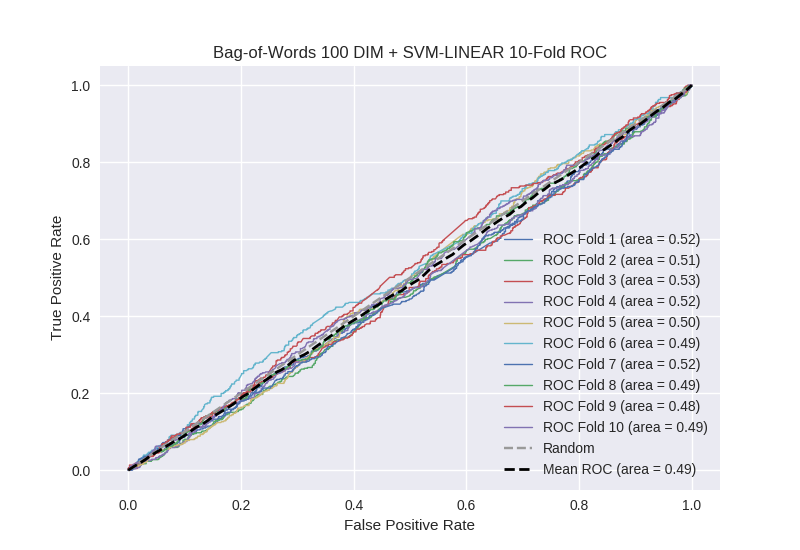

# Bag-of-Words 100 DIM + SVM-LINEAR
**Model Performance Score Report**

### K-Fold Classification Report
| K | Accuracy | Precision | Recall | F-Measure | AUC | Kappa |
| --- | --- | --- | --- | --- | --- | --- |
| 1 | 0.600341102899 | 0.254606365159 | 0.370731707317 | 0.301886792453 | 0.520428863295 | 0.0352605336514 |
| 2 | 0.592150170648 | 0.285464098074 | 0.345338983051 | 0.312559923298 | 0.514038076284 | 0.0263284333794 |
| 3 | 0.590443686007 | 0.274447949527 | 0.400921658986 | 0.325842696629 | 0.526744817408 | 0.0463159417494 |
| 4 | 0.601251422071 | 0.278985507246 | 0.336980306346 | 0.305252725471 | 0.515530891067 | 0.0290996412179 |
| 5 | 0.58646188851 | 0.25834797891 | 0.325221238938 | 0.287952987267 | 0.50104859803 | 0.00193355625977 |
| 6 | 0.564846416382 | 0.223420647149 | 0.357142857143 | 0.274881516588 | 0.492180896027 | -0.0129306124416 |
| 7 | 0.584755403868 | 0.272 | 0.38202247191 | 0.317757009346 | 0.517743909222 | 0.0313026018825 |
| 8 | 0.54550625711 | 0.246753246753 | 0.381696428571 | 0.299737072743 | 0.491611573064 | -0.0142185638471 |
| 9 | 0.580773606371 | 0.225378787879 | 0.266219239374 | 0.244102564103 | 0.477121824111 | -0.0431781181915 |
| 10 | 0.559158134243 | 0.253543307087 | 0.348484848485 | 0.293527803099 | 0.491372053872 | -0.0154003693585 |

### Average Confusion Matrix
| | Pred POS | Pred NEG |
| --- | --- | --- |
| **True POS** | 155.6 | 287.7 |
| **True NEG** | 449.7 | 865.1 |

### Average Model Performance Metrics
| ACC | PRE | REC | F1 | AUC | KAPP |
| --- | --- | --- | --- | --- | --- |
| 0.580568808811 | 0.257294788778 | 0.351475974012 | 0.2963501091 | 0.504782150238 | 0.00845130443018 |

### AUC/ROC Plot

