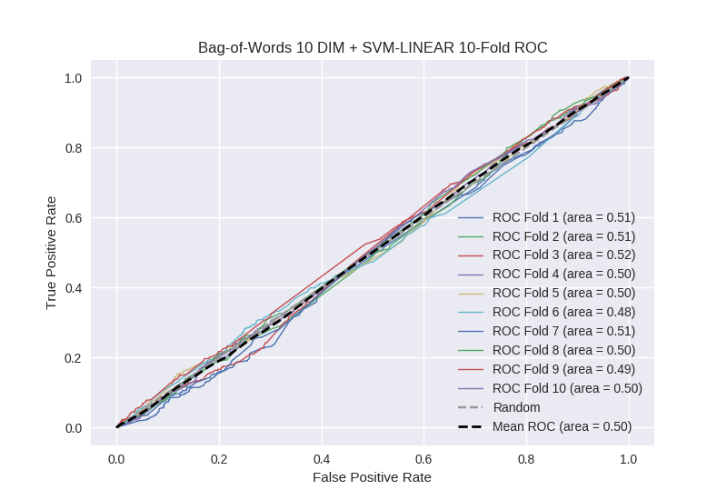

# Bag-of-Words 10 DIM + SVM-LINEAR
**Model Performance Score Report**

### K-Fold Classification Report
| K | Accuracy | Precision | Recall | F-Measure | AUC | Kappa |
| --- | --- | --- | --- | --- | --- | --- |
| 1 | 0.293348493462 | 0.237555135476 | 0.919512195122 | 0.377566349524 | 0.511275741742 | 0.0112807234206 |
| 2 | 0.336746302617 | 0.272010512484 | 0.877118644068 | 0.415245737212 | 0.507766164958 | 0.0091149735774 |
| 3 | 0.361205915813 | 0.254804270463 | 0.824884792627 | 0.389342033714 | 0.517049647069 | 0.0194633812484 |
| 4 | 0.380546075085 | 0.259146341463 | 0.74398249453 | 0.384397964952 | 0.498432446342 | -0.00195108267294 |
| 5 | 0.38850967008 | 0.259459459459 | 0.743362831858 | 0.384659416142 | 0.504529807966 | 0.005627856416 |
| 6 | 0.35779294653 | 0.223412394797 | 0.71921182266 | 0.340922358435 | 0.484236088845 | -0.0177481963111 |
| 7 | 0.327076222981 | 0.259452411995 | 0.894382022472 | 0.402223345124 | 0.514593905372 | 0.0161357011139 |
| 8 | 0.355517633675 | 0.25377426312 | 0.787946428571 | 0.383904295813 | 0.497790008179 | -0.00261146285209 |
| 9 | 0.316268486917 | 0.2504957039 | 0.847874720358 | 0.386734693878 | 0.491443081003 | -0.00958310758708 |
| 10 | 0.358930602958 | 0.261306532663 | 0.787878787879 | 0.392452830189 | 0.496948653199 | -0.00370220642992 |

### Average Confusion Matrix
| | Pred POS | Pred NEG |
| --- | --- | --- |
| **True POS** | 361.1 | 82.2 |
| **True NEG** | 1064.8 | 250.0 |

### Average Model Performance Metrics
| ACC | PRE | REC | F1 | AUC | KAPP |
| --- | --- | --- | --- | --- | --- |
| 0.347594235012 | 0.253141702582 | 0.814615474014 | 0.385744902498 | 0.502406554467 | 0.00260265799232 |

### AUC/ROC Plot

