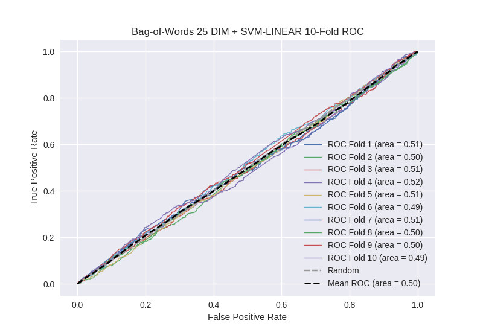

# Bag-of-Words 25 DIM + SVM-LINEAR
**Model Performance Score Report**

### K-Fold Classification Report
| K | Accuracy | Precision | Recall | F-Measure | AUC | Kappa |
| --- | --- | --- | --- | --- | --- | --- |
| 1 | 0.594656054576 | 0.245378151261 | 0.356097560976 | 0.290547263682 | 0.511629210436 | 0.0201016489634 |
| 2 | 0.596131968146 | 0.272030651341 | 0.300847457627 | 0.285714285714 | 0.502678783246 | 0.00518377535698 |
| 3 | 0.56598407281 | 0.255572065379 | 0.396313364055 | 0.310749774164 | 0.508957286257 | 0.0151166496077 |
| 4 | 0.561433447099 | 0.277620396601 | 0.428884026258 | 0.337059329321 | 0.518438938571 | 0.0313391982963 |
| 5 | 0.554038680319 | 0.266853932584 | 0.420353982301 | 0.3264604811 | 0.510330130507 | 0.0173897669007 |
| 6 | 0.449943117179 | 0.226341463415 | 0.571428571429 | 0.324248777079 | 0.492445054945 | -0.00985387888069 |
| 7 | 0.562002275313 | 0.260677466863 | 0.397752808989 | 0.314946619217 | 0.507711134121 | 0.0131386137603 |
| 8 | 0.467007963595 | 0.253279515641 | 0.560267857143 | 0.348853370396 | 0.49769118048 | -0.00330120244167 |
| 9 | 0.505688282139 | 0.250591016548 | 0.474272930649 | 0.327919566899 | 0.495336312769 | -0.00720742103285 |
| 10 | 0.548919226394 | 0.249621785174 | 0.357142857143 | 0.293855743544 | 0.48721340388 | -0.0224603401615 |

### Average Confusion Matrix
| | Pred POS | Pred NEG |
| --- | --- | --- |
| **True POS** | 188.3 | 255.0 |
| **True NEG** | 552.7 | 762.1 |

### Average Model Performance Metrics
| ACC | PRE | REC | F1 | AUC | KAPP |
| --- | --- | --- | --- | --- | --- |
| 0.540580508757 | 0.255796644481 | 0.426336141657 | 0.316035521112 | 0.503243143521 | 0.00594468103686 |

### AUC/ROC Plot

