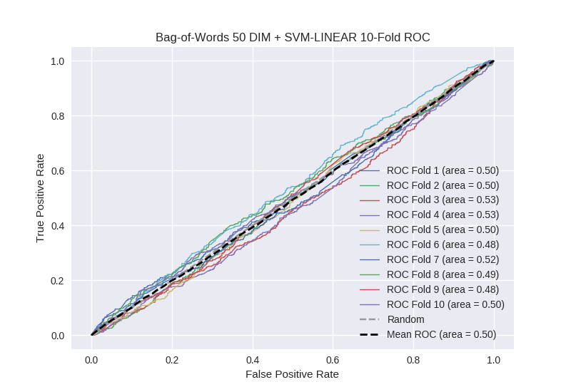

# Bag-of-Words 50 DIM + SVM-LINEAR
**Model Performance Score Report**

### K-Fold Classification Report
| K | Accuracy | Precision | Recall | F-Measure | AUC | Kappa |
| --- | --- | --- | --- | --- | --- | --- |
| 1 | 0.495736213758 | 0.235880398671 | 0.519512195122 | 0.324447829398 | 0.504011101267 | 0.00565544605945 |
| 2 | 0.504550625711 | 0.267211201867 | 0.485169491525 | 0.344620015049 | 0.498416783088 | -0.00251673787821 |
| 3 | 0.577929465301 | 0.276811594203 | 0.440092165899 | 0.339857651246 | 0.531601974188 | 0.0527466973404 |
| 4 | 0.540955631399 | 0.285539215686 | 0.509846827133 | 0.366064414768 | 0.530864996964 | 0.0491947644611 |
| 5 | 0.539817974972 | 0.256480218281 | 0.41592920354 | 0.317299578059 | 0.49931222811 | -0.00114318054791 |
| 6 | 0.471558589306 | 0.216684723727 | 0.492610837438 | 0.300978179082 | 0.478923761914 | -0.0291611475412 |
| 7 | 0.525028441411 | 0.268957345972 | 0.510112359551 | 0.352211016292 | 0.52009806858 | 0.0310066261712 |
| 8 | 0.449374288965 | 0.24609375 | 0.5625 | 0.342391304348 | 0.48659351145 | -0.0188424400337 |
| 9 | 0.567690557452 | 0.236974789916 | 0.315436241611 | 0.270633397313 | 0.484567853834 | -0.0278281660366 |
| 10 | 0.486916951081 | 0.259825327511 | 0.515151515152 | 0.345428156749 | 0.496001683502 | -0.0060756024211 |

### Average Confusion Matrix
| | Pred POS | Pred NEG |
| --- | --- | --- |
| **True POS** | 211.2 | 232.1 |
| **True NEG** | 618.9 | 695.9 |

### Average Model Performance Metrics
| ACC | PRE | REC | F1 | AUC | KAPP |
| --- | --- | --- | --- | --- | --- |
| 0.515955873936 | 0.255045856583 | 0.476636083697 | 0.33039315423 | 0.50303919629 | 0.00530362595734 |

### AUC/ROC Plot

