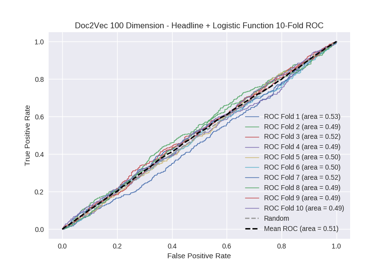

# Doc2Vec 100 Dimension - Headline + Logistic Function
**Model Performance Score Report**

### K-Fold Classification Report
| K | Accuracy | Precision | Recall | F-Measure | AUC | Kappa |
| --- | --- | --- | --- | --- | --- | --- |
| 1 | 0.6725412166 | 0.27807486631 | 0.253658536585 | 0.265306122449 | 0.526755139308 | 0.0551970577484 |
| 2 | 0.688282138794 | 0.243243243243 | 0.0762711864407 | 0.116129032258 | 0.494589714527 | -0.0138237596922 |
| 3 | 0.606370875995 | 0.267985611511 | 0.34331797235 | 0.30101010101 | 0.517958079831 | 0.0328157149081 |
| 4 | 0.435153583618 | 0.251851851852 | 0.595185995624 | 0.353936239427 | 0.487062636551 | -0.0179412989249 |
| 5 | 0.617178612059 | 0.256070640177 | 0.256637168142 | 0.25635359116 | 0.499298675954 | -0.00140163422425 |
| 6 | 0.711035267349 | 0.234375 | 0.110837438424 | 0.150501672241 | 0.501054813886 | 0.00258661127119 |
| 7 | 0.572241183163 | 0.269865067466 | 0.404494382022 | 0.323741007194 | 0.516794030311 | 0.0288334535645 |
| 8 | 0.57337883959 | 0.245791245791 | 0.325892857143 | 0.280230326296 | 0.491954062159 | -0.0145335684804 |
| 9 | 0.628555176337 | 0.243781094527 | 0.219239373602 | 0.2308598351 | 0.493677657815 | -0.0130785400749 |
| 10 | 0.678612059158 | 0.230366492147 | 0.0952380952381 | 0.134762633997 | 0.490906084656 | -0.0224191705525 |

### Average Confusion Matrix
| | Pred POS | Pred NEG |
| --- | --- | --- |
| **True POS** | 119.0 | 324.3 |
| **True NEG** | 346.7 | 968.1 |

### Average Model Performance Metrics
| ACC | PRE | REC | F1 | AUC | KAPP |
| --- | --- | --- | --- | --- | --- |
| 0.618334895266 | 0.252140511302 | 0.268077300557 | 0.241283056113 | 0.5020050895 | 0.00362348655432 |

### AUC/ROC Plot

