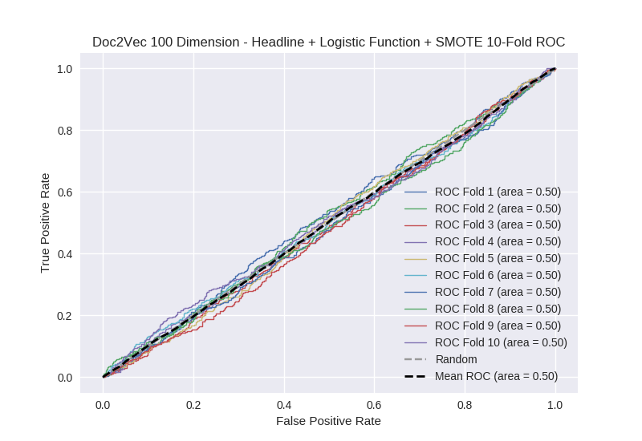

# Doc2Vec 100 Dimension - Headline + Logistic Function + SMOTE
**Model Performance Score Report**

### K-Fold Classification Report
| K | Accuracy | Precision | Recall | F-Measure | AUC | Kappa |
| --- | --- | --- | --- | --- | --- | --- |
| 1 | 0.236498010233 | 0.232050545663 | 0.985365853659 | 0.375639237564 | 0.497130665895 | -0.00269440986354 |
| 2 | 0.278156996587 | 0.270317002882 | 0.993644067797 | 0.425011327594 | 0.504598083665 | 0.00497933602311 |
| 3 | 0.250284414107 | 0.247139588101 | 0.995391705069 | 0.39596700275 | 0.500717000571 | 0.00071074554102 |
| 4 | 0.262229806598 | 0.258897818599 | 0.986870897155 | 0.410186448386 | 0.497278646118 | -0.00284651930329 |
| 5 | 0.26393629124 | 0.258323765786 | 0.995575221239 | 0.410209662716 | 0.503147488108 | 0.00325638702282 |
| 6 | 0.236632536974 | 0.231034482759 | 0.990147783251 | 0.374650512582 | 0.500251406419 | 0.000233919318176 |
| 7 | 0.261660978385 | 0.254744105808 | 0.995505617978 | 0.405677655678 | 0.504226533284 | 0.00431022069482 |
| 8 | 0.262229806598 | 0.255894192064 | 0.993303571429 | 0.406950160037 | 0.502758655943 | 0.00283215006372 |
| 9 | 0.257110352673 | 0.254431103488 | 0.995525727069 | 0.405282331512 | 0.500432581307 | 0.000441452666609 |
| 10 | 0.271899886234 | 0.264400921659 | 0.993506493506 | 0.417652411283 | 0.504083493667 | 0.00432739533278 |

### Average Confusion Matrix
| | Pred POS | Pred NEG |
| --- | --- | --- |
| **True POS** | 440.0 | 3.3 |
| **True NEG** | 1301.1 | 13.7 |

### Average Model Performance Metrics
| ACC | PRE | REC | F1 | AUC | KAPP |
| --- | --- | --- | --- | --- | --- |
| 0.258063907963 | 0.252723352681 | 0.992483693815 | 0.40272267501 | 0.501462455498 | 0.00155506774962 |

### AUC/ROC Plot

