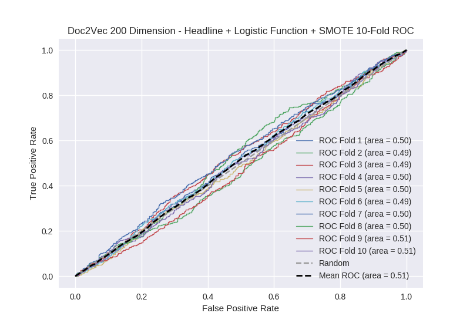

# Doc2Vec 200 Dimension - Headline + Logistic Function + SMOTE
**Model Performance Score Report**

### K-Fold Classification Report
| K | Accuracy | Precision | Recall | F-Measure | AUC | Kappa |
| --- | --- | --- | --- | --- | --- | --- |
| 1 | 0.733939738488 | 0.21568627451 | 0.0536585365854 | 0.0859375 | 0.49717767452 | -0.00764289421373 |
| 2 | 0.700796359499 | 0.23 | 0.0487288135593 | 0.0804195804196 | 0.494426615178 | -0.0148511374312 |
| 3 | 0.711604095563 | 0.165137614679 | 0.0414746543779 | 0.0662983425414 | 0.486371768277 | -0.0364240181771 |
| 4 | 0.292377701934 | 0.2596212584 | 0.929978118162 | 0.405921680993 | 0.49919351719 | -0.000877789544694 |
| 5 | 0.720136518771 | 0.261904761905 | 0.0486725663717 | 0.0820895522388 | 0.50059968288 | 0.00163443958114 |
| 6 | 0.740614334471 | 0.162162162162 | 0.0295566502463 | 0.05 | 0.49184933104 | -0.0228337535343 |
| 7 | 0.726962457338 | 0.203389830508 | 0.0269662921348 | 0.047619047619 | 0.495585202427 | -0.0123787974403 |
| 8 | 0.720136518771 | 0.270833333333 | 0.0580357142857 | 0.0955882352941 | 0.502300299891 | 0.00620450033091 |
| 9 | 0.280432309443 | 0.257125890736 | 0.968680089485 | 0.406381980291 | 0.507223339937 | 0.00755622317367 |
| 10 | 0.722411831627 | 0.319444444444 | 0.0497835497835 | 0.0861423220974 | 0.505987453904 | 0.0164403538459 |

### Average Confusion Matrix
| | Pred POS | Pred NEG |
| --- | --- | --- |
| **True POS** | 101.6 | 341.7 |
| **True NEG** | 300.1 | 1014.7 |

### Average Model Performance Metrics
| ACC | PRE | REC | F1 | AUC | KAPP |
| --- | --- | --- | --- | --- | --- |
| 0.634941186591 | 0.234530557068 | 0.225553498499 | 0.140639824149 | 0.498071488524 | -0.00631728734096 |

### AUC/ROC Plot

