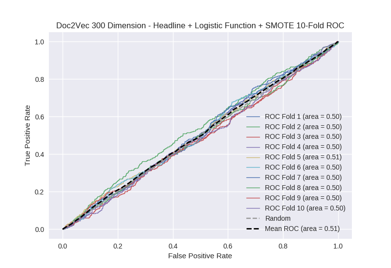

# Doc2Vec 300 Dimension - Headline + Logistic Function + SMOTE
**Model Performance Score Report**

### K-Fold Classification Report
| K | Accuracy | Precision | Recall | F-Measure | AUC | Kappa |
| --- | --- | --- | --- | --- | --- | --- |
| 1 | 0.237635019898 | 0.231700288184 | 0.980487804878 | 0.374825174825 | 0.496174221194 | -0.00360115812292 |
| 2 | 0.280432309443 | 0.270411117545 | 0.989406779661 | 0.424738517508 | 0.504812254527 | 0.00522644498858 |
| 3 | 0.251422070535 | 0.247422680412 | 0.995391705069 | 0.396330275229 | 0.50147228758 | 0.0014605647517 |
| 4 | 0.266211604096 | 0.258270458503 | 0.973741794311 | 0.408256880734 | 0.495710251498 | -0.00451892215601 |
| 5 | 0.268486916951 | 0.259792626728 | 0.997787610619 | 0.412248628885 | 0.506933621543 | 0.00718965729242 |
| 6 | 0.237770193402 | 0.230680507497 | 0.985221674877 | 0.373831775701 | 0.499267642172 | -0.00068306010929 |
| 7 | 0.258816837315 | 0.253164556962 | 0.988764044944 | 0.403114979386 | 0.500094132144 | 9.60323786261e-05 |
| 8 | 0.26393629124 | 0.255773672055 | 0.988839285714 | 0.406422018349 | 0.502434910033 | 0.00250639314416 |
| 9 | 0.260523321957 | 0.253610629694 | 0.982102908277 | 0.403122130395 | 0.49829783095 | -0.00174891843202 |
| 10 | 0.273037542662 | 0.262790697674 | 0.978354978355 | 0.414298808433 | 0.499979958313 | -2.13648964069e-05 |

### Average Confusion Matrix
| | Pred POS | Pred NEG |
| --- | --- | --- |
| **True POS** | 437.1 | 6.2 |
| **True NEG** | 1295.1 | 19.7 |

### Average Model Performance Metrics
| ACC | PRE | REC | F1 | AUC | KAPP |
| --- | --- | --- | --- | --- | --- |
| 0.25982721075 | 0.252361723526 | 0.986009858671 | 0.401718918944 | 0.500517710995 | 0.000590566883884 |

### AUC/ROC Plot

