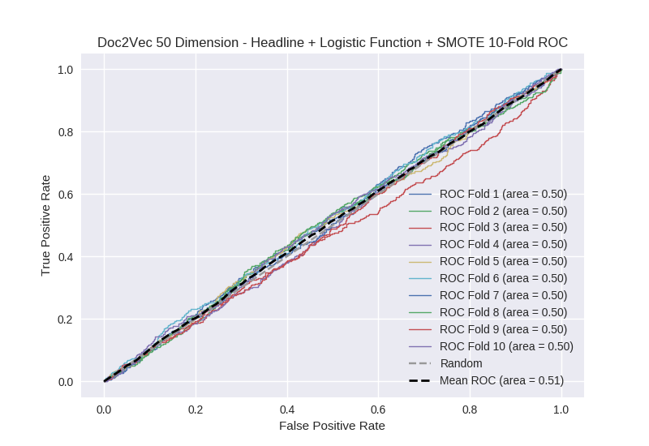

# Doc2Vec 50 Dimension - Headline + Logistic Function + SMOTE
**Model Performance Score Report**

### K-Fold Classification Report
| K | Accuracy | Precision | Recall | F-Measure | AUC | Kappa |
| --- | --- | --- | --- | --- | --- | --- |
| 1 | 0.234792495736 | 0.232265446224 | 0.990243902439 | 0.376274328082 | 0.497716465675 | -0.00213835658069 |
| 2 | 0.269624573379 | 0.268 | 0.993644067797 | 0.422142214221 | 0.49876604634 | -0.00132902980824 |
| 3 | 0.248577929465 | 0.246426529445 | 0.993087557604 | 0.394869445717 | 0.498809639829 | -0.00117952286231 |
| 4 | 0.260523321957 | 0.258452722063 | 0.986870897155 | 0.409627611262 | 0.496125686856 | -0.0040479995923 |
| 5 | 0.262229806598 | 0.258433390509 | 1.0 | 0.41072239891 | 0.503445635528 | 0.00355553690967 |
| 6 | 0.234357224118 | 0.231121281465 | 0.995073891626 | 0.375116063138 | 0.500495525694 | 0.000459584447798 |
| 7 | 0.259385665529 | 0.254441260745 | 0.997752808989 | 0.405479452055 | 0.503446092232 | 0.00350635837647 |
| 8 | 0.257679180887 | 0.255002858776 | 0.995535714286 | 0.40600819299 | 0.500439612868 | 0.000449629709021 |
| 9 | 0.257110352673 | 0.254711593375 | 0.997762863535 | 0.405823475887 | 0.501169761287 | 0.0011928533208 |
| 10 | 0.268486916951 | 0.263490241102 | 0.993506493506 | 0.416515426497 | 0.501768678852 | 0.00187017885903 |

### Average Confusion Matrix
| | Pred POS | Pred NEG |
| --- | --- | --- |
| **True POS** | 440.8 | 2.5 |
| **True NEG** | 1306.8 | 8.0 |

### Average Model Performance Metrics
| ACC | PRE | REC | F1 | AUC | KAPP |
| --- | --- | --- | --- | --- | --- |
| 0.255276746729 | 0.25223453237 | 0.994347819694 | 0.402257860876 | 0.500218314516 | 0.000233923277925 |

### AUC/ROC Plot

