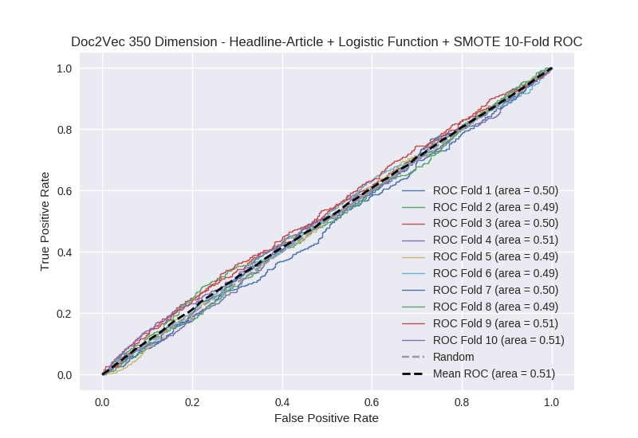

# Doc2Vec 350 Dimension - Headline-Article + Logistic Function + SMOTE
**Model Performance Score Report**

### K-Fold Classification Report
| K | Accuracy | Precision | Recall | F-Measure | AUC | Kappa |
| --- | --- | --- | --- | --- | --- | --- |
| 1 | 0.266628766345 | 0.234939759036 | 0.951219512195 | 0.376811594203 | 0.504890704949 | 0.00474575973824 |
| 2 | 0.324800910125 | 0.264647794602 | 0.851694915254 | 0.403817177298 | 0.491555078156 | -0.00992332940672 |
| 3 | 0.310580204778 | 0.245751633987 | 0.866359447005 | 0.382892057026 | 0.497379119273 | -0.00283526116031 |
| 4 | 0.288395904437 | 0.26284348865 | 0.962800875274 | 0.412951665885 | 0.507149861157 | 0.00767237808526 |
| 5 | 0.354379977247 | 0.253073029646 | 0.774336283186 | 0.381471389646 | 0.491685752619 | -0.00993674134407 |
| 6 | 0.29180887372 | 0.226353555121 | 0.854679802956 | 0.357916451779 | 0.488730434022 | -0.0114345604321 |
| 7 | 0.29180887372 | 0.251552795031 | 0.910112359551 | 0.394160583942 | 0.496183369417 | -0.00409213731598 |
| 8 | 0.315699658703 | 0.248500999334 | 0.832589285714 | 0.382760389944 | 0.485760291712 | -0.0160599890653 |
| 9 | 0.306598407281 | 0.258145363409 | 0.921700223714 | 0.403328438571 | 0.509286420019 | 0.0100555717236 |
| 10 | 0.342434584755 | 0.265856950067 | 0.852813852814 | 0.405349794239 | 0.506653839987 | 0.00778055096612 |

### Average Confusion Matrix
| | Pred POS | Pred NEG |
| --- | --- | --- |
| **True POS** | 388.9 | 54.4 |
| **True NEG** | 1159.9 | 154.9 |

### Average Model Performance Metrics
| ACC | PRE | REC | F1 | AUC | KAPP |
| --- | --- | --- | --- | --- | --- |
| 0.309313616111 | 0.251166536888 | 0.877830655766 | 0.390145954253 | 0.497927487131 | -0.00240277582113 |

### AUC/ROC Plot

