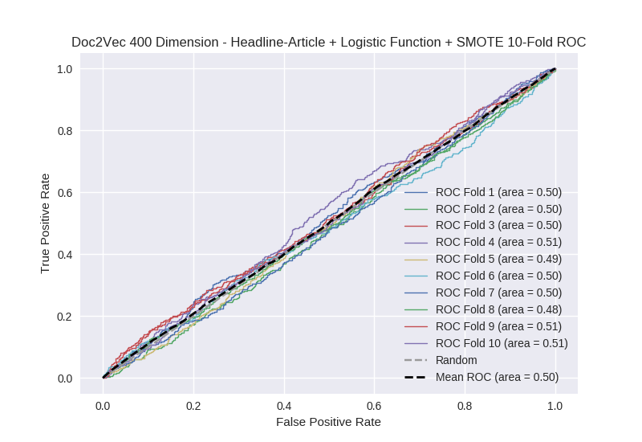

# Doc2Vec 400 Dimension - Headline-Article + Logistic Function + SMOTE
**Model Performance Score Report**

### K-Fold Classification Report
| K | Accuracy | Precision | Recall | F-Measure | AUC | Kappa |
| --- | --- | --- | --- | --- | --- | --- |
| 1 | 0.312109152928 | 0.232262382865 | 0.846341463415 | 0.364495798319 | 0.498041005985 | -0.00204043584538 |
| 2 | 0.411262798635 | 0.270951993491 | 0.705508474576 | 0.391534391534 | 0.504387207739 | 0.00582018618913 |
| 3 | 0.277588168373 | 0.248192771084 | 0.94930875576 | 0.393505253104 | 0.503355284225 | 0.00344228547759 |
| 4 | 0.333902161547 | 0.262948207171 | 0.866520787746 | 0.403464085583 | 0.506665466894 | 0.00764146986941 |
| 5 | 0.306029579067 | 0.254475703325 | 0.880530973451 | 0.394841269841 | 0.493864261611 | -0.00680100944856 |
| 6 | 0.44425483504 | 0.231924882629 | 0.608374384236 | 0.335825968729 | 0.501672399219 | 0.00213334820635 |
| 7 | 0.386234357224 | 0.254263565891 | 0.737078651685 | 0.378097982709 | 0.502202692179 | 0.00270658191511 |
| 8 | 0.346985210466 | 0.247474747475 | 0.765625 | 0.374045801527 | 0.484720896947 | -0.0180939870333 |
| 9 | 0.363481228669 | 0.260342368046 | 0.816554809843 | 0.394808004327 | 0.51277778631 | 0.0149973412166 |
| 10 | 0.374857792947 | 0.269035532995 | 0.80303030303 | 0.403041825095 | 0.512626262626 | 0.0154106290533 |

### Average Confusion Matrix
| | Pred POS | Pred NEG |
| --- | --- | --- |
| **True POS** | 354.0 | 89.3 |
| **True NEG** | 1043.5 | 271.3 |

### Average Model Performance Metrics
| ACC | PRE | REC | F1 | AUC | KAPP |
| --- | --- | --- | --- | --- | --- |
| 0.35567052849 | 0.253187215497 | 0.797887360374 | 0.383366038077 | 0.502031326373 | 0.00252164096002 |

### AUC/ROC Plot

