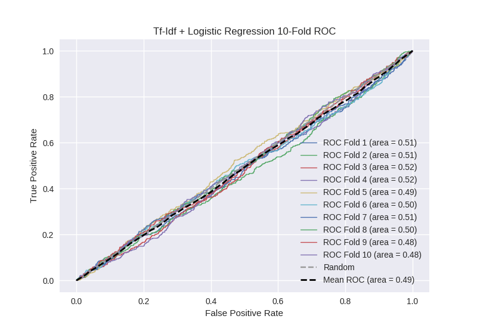

# Tf-Idf + Logistic Regression
**Model Performance Score Report**

### K-Fold Classification Report
| K | Accuracy | Precision | Recall | F-Measure | AUC | Kappa |
| --- | --- | --- | --- | --- | --- | --- |
| 1 | 0.587833996589 | 0.248 | 0.378048780488 | 0.299516908213 | 0.514821276827 | 0.0250675616273 |
| 2 | 0.585893060296 | 0.28231292517 | 0.351694915254 | 0.31320754717 | 0.511772807549 | 0.0218463965369 |
| 3 | 0.602389078498 | 0.274275979557 | 0.370967741935 | 0.315377081293 | 0.524607738037 | 0.0440017986591 |
| 4 | 0.596700796359 | 0.28275862069 | 0.35886214442 | 0.316297010608 | 0.519554054531 | 0.0359680291061 |
| 5 | 0.57337883959 | 0.248310810811 | 0.325221238938 | 0.281609195402 | 0.492243085013 | -0.0140872368834 |
| 6 | 0.598976109215 | 0.228675136116 | 0.310344827586 | 0.263322884013 | 0.49799785758 | -0.00355953146331 |
| 7 | 0.591581342435 | 0.267461669506 | 0.352808988764 | 0.304263565891 | 0.512657350437 | 0.0228993688004 |
| 8 | 0.577929465301 | 0.258223684211 | 0.350446428571 | 0.297348484848 | 0.503085809706 | 0.0055226884606 |
| 9 | 0.568259385666 | 0.231958762887 | 0.302013422819 | 0.262390670554 | 0.48052616221 | -0.0354224575028 |
| 10 | 0.564277588168 | 0.240614334471 | 0.305194805195 | 0.269083969466 | 0.480915303832 | -0.0351351351351 |

### Average Confusion Matrix
| | Pred POS | Pred NEG |
| --- | --- | --- |
| **True POS** | 150.9 | 292.4 |
| **True NEG** | 437.7 | 877.1 |

### Average Model Performance Metrics
| ACC | PRE | REC | F1 | AUC | KAPP |
| --- | --- | --- | --- | --- | --- |
| 0.584721966212 | 0.256259192342 | 0.340560329397 | 0.292241731746 | 0.503818144572 | 0.00671014822057 |

### AUC/ROC Plot

