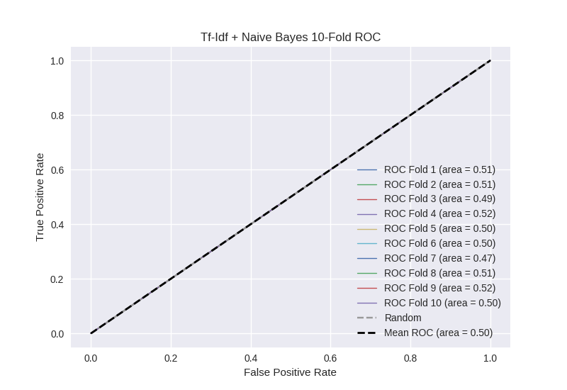

# Tf-Idf + Naive Bayes
**Model Performance Score Report**

### K-Fold Classification Report
| K | Accuracy | Precision | Recall | F-Measure | AUC | Kappa |
| --- | --- | --- | --- | --- | --- | --- |
| 1 | 0.501421262081 | 0.239687848384 | 0.524390243902 | 0.328997704667 | 0.509415285035 | 0.0133229035615 |
| 2 | 0.503981797497 | 0.27728285078 | 0.527542372881 | 0.363503649635 | 0.511438371511 | 0.0177940320923 |
| 3 | 0.484641638225 | 0.23719376392 | 0.490783410138 | 0.31981981982 | 0.486705904465 | -0.0195596956072 |
| 4 | 0.512514220705 | 0.273242630385 | 0.527352297593 | 0.35997012696 | 0.51732718646 | 0.0266233539689 |
| 5 | 0.503412969283 | 0.257767548907 | 0.495575221239 | 0.339137017411 | 0.500850397756 | 0.00130666045439 |
| 6 | 0.499431171786 | 0.23006833713 | 0.497536945813 | 0.314641744548 | 0.498768472906 | -0.0017509143088 |
| 7 | 0.473833902162 | 0.230337078652 | 0.460674157303 | 0.307116104869 | 0.469484070274 | -0.0458699664915 |
| 8 | 0.51023890785 | 0.259043173862 | 0.495535714286 | 0.340229885057 | 0.505401444929 | 0.00830757417524 |
| 9 | 0.508532423208 | 0.267558528428 | 0.536912751678 | 0.357142857143 | 0.517884293459 | 0.0268587178393 |
| 10 | 0.492036405006 | 0.259754738016 | 0.504329004329 | 0.342899190581 | 0.495991662658 | -0.00615268660906 |

### Average Confusion Matrix
| | Pred POS | Pred NEG |
| --- | --- | --- |
| **True POS** | 224.4 | 218.9 |
| **True NEG** | 661.9 | 652.9 |

### Average Model Performance Metrics
| ACC | PRE | REC | F1 | AUC | KAPP |
| --- | --- | --- | --- | --- | --- |
| 0.49900446978 | 0.253193649846 | 0.506063211916 | 0.337345810069 | 0.501326708945 | 0.0020879979075 |

### AUC/ROC Plot

